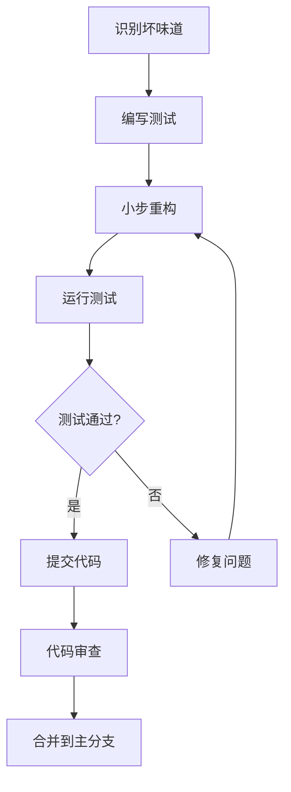

# 25. 总结与最佳实践

本章总结所有代码坏味道的重构方法，并提供前端开发中的最佳实践指南。

## 代码坏味道回顾

### 24种代码坏味道分类总结

| 类别 | 坏味道 | 核心问题 | 主要重构方法 |
|------|--------|----------|-------------|
| **重复代码** | 重复代码 | 相同逻辑在多个地方出现 | 提取方法、提取类、模板方法 |
| **过长代码** | 过长函数 | 函数体过长难以理解 | 提取方法、替换算法 |
| | 过大的类 | 类承担过多职责 | 提取类、提取子类、提取接口 |
| | 过长参数列 | 参数过多难以维护 | 引入参数对象、保持对象完整 |
| **变化相关** | 发散式变化 | 一个类因不同原因被修改 | 提取类、搬移方法 |
| | 霰弹式修改 | 一个变化需要修改多个类 | 搬移方法、搬移字段、内联类 |
| **依赖问题** | 依恋情结 | 函数过度访问其他对象数据 | 搬移方法、提取方法 |
| | 数据泥团 | 总是绑在一起出现的数据 | 提取类、引入参数对象 |
| | 基本类型偏执 | 过度使用基本类型 | 用对象替换基本类型、用类替换类型码 |
| **条件逻辑** | Switch语句 | 复杂条件判断逻辑 | 用多态替换条件表达式、用状态/策略模式 |
| | 循环复杂度 | 条件逻辑过于复杂 | 提取方法、卫语句、表驱动方法 |
| **继承问题** | 平行继承体系 | 两个继承体系一一对应 | 搬移方法、搬移字段 |
| | 被拒绝的遗赠 | 子类不需要父类所有方法 | 用委托替换继承、提取子类 |
| **类设计** | 冗余类 | 没有足够职责的类 | 内联类、折叠继承体系 |
| | 夸夸其谈未来性 | 为未来过度设计 | 折叠继承体系、内联类、删除参数 |
| | 临时字段 | 只在特定情况下使用的字段 | 提取类、引入Null对象 |
| | 数据类 | 只有字段和getter/setter | 搬移方法、封装集合 |
| **对象交互** | 过度的消息链 | 过长的对象调用链 | 隐藏委托关系、提取方法 |
| | 中间人 | 类的大部分方法都是委托 | 移除中间人、内联方法 |
| | 不恰当的亲密关系 | 类之间过度了解实现 | 搬移方法、搬移字段、提取类 |
| | 异曲同工的类 | 功能相似但接口不同 | 重命名方法、搬移方法、提取超类 |
| **库和注释** | 不完美的库类 | 第三方库不完全符合需求 | 引入外部方法、引入本地扩展 |
| | 过多的注释 | 注释过多表明代码需要重构 | 提取方法、重命名、用断言替换注释 |
| | 魔法数字 | 代码中直接出现的数字 | 提取常量、用符号常量替换魔法数字 |

## 前端开发最佳实践

### 1. JavaScript代码质量准则

#### 命名规范
```javascript
// 好的命名
class UserService {
  async getUserProfile(userId) {
    // ...
  }
}

// 不好的命名
class US {
  async getUP(uid) {
    // ...
  }
}
```

#### 函数设计原则
```javascript
// 单一职责原则
class OrderProcessor {
  // 好的：每个方法只做一件事
  validateOrder(order) { /* 验证订单 */ }
  calculateTotal(order) { /* 计算总额 */ }
  processPayment(order) { /* 处理支付 */ }
  
  // 不好的：一个方法做太多事情
  processOrder(order) {
    this.validateOrder(order);
    this.calculateTotal(order);
    this.processPayment(order);
    this.sendNotification(order);
    this.updateInventory(order);
  }
}
```

### 2. 重构时机判断

#### 应该重构的情况
- 添加新功能时发现代码难以扩展
- 修复bug时发现代码难以理解
- 代码审查中发现质量问题
- 性能优化需要改善代码结构

#### 重构的黄金法则
```javascript
// 重构前确保有测试覆盖
describe('OrderProcessor', () => {
  it('should process valid order', async () => {
    const processor = new OrderProcessor();
    const order = createTestOrder();
    
    const result = await processor.process(order);
    
    expect(result.success).toBe(true);
  });
});

// 小步重构，频繁提交
// 1. 先写测试
// 2. 小步重构
// 3. 运行测试
// 4. 提交代码
```

### 3. 前端特定重构技巧

#### 组件提取
```javascript
// 重构前：大型组件
function UserProfile({ user }) {
  return (
    <div className="user-profile">
      <div className="header">
        
        <h2>{user.name}</h2>
        <span>{user.title}</span>
      </div>
      <div className="content">
        <div className="bio">{user.bio}</div>
        <div className="stats">
          <span>关注: {user.following}</span>
          <span>粉丝: {user.followers}</span>
        </div>
        <div className="actions">
          <button>关注</button>
          <button>私信</button>
        </div>
      </div>
    </div>
  );
}

// 重构后：提取子组件
function UserProfile({ user }) {
  return (
    <div className="user-profile">
      <UserHeader user={user} />
      <UserContent user={user} />
      <UserActions user={user} />
    </div>
  );
}

function UserHeader({ user }) {
  return (
    <div className="header">
      
      <h2>{user.name}</h2>
      <span>{user.title}</span>
    </div>
  );
}
```

#### 状态管理重构
```javascript
// 重构前：状态分散
class ShoppingCart {
  constructor() {
    this.items = [];
    this.total = 0;
    this.discount = 0;
    this.tax = 0;
    this.finalTotal = 0;
  }
  
  addItem(item) {
    this.items.push(item);
    this.calculateTotal();
    this.calculateDiscount();
    this.calculateTax();
    this.calculateFinalTotal();
  }
  
  // 多个计算方法...
}

// 重构后：状态集中管理
class ShoppingCart {
  constructor() {
    this.state = {
      items: [],
      totals: this.calculateTotals([])
    };
  }
  
  addItem(item) {
    const newItems = [...this.state.items, item];
    this.state = {
      items: newItems,
      totals: this.calculateTotals(newItems)
    };
  }
  
  calculateTotals(items) {
    const subtotal = items.reduce((sum, item) => sum + item.price, 0);
    const discount = this.calculateDiscount(subtotal);
    const tax = this.calculateTax(subtotal - discount);
    
    return {
      subtotal,
      discount,
      tax,
      total: subtotal - discount + tax
    };
  }
}
```

### 4. 工具和自动化

#### 代码质量工具
```json
{
  "scripts": {
    "lint": "eslint src/",
    "lint:fix": "eslint src/ --fix",
    "test": "jest",
    "test:coverage": "jest --coverage",
    "complexity": "complexity-report src/",
    "audit": "npm audit"
  }
}
```

#### Git钩子自动化
```json
{
  "husky": {
    "hooks": {
      "pre-commit": "lint-staged",
      "pre-push": "npm run test"
    }
  },
  "lint-staged": {
    "*.{js,jsx,ts,tsx}": [
      "eslint --fix",
      "prettier --write"
    ]
  }
}
```

### 5. 团队协作规范

#### 代码审查清单
- [ ] 代码是否遵循项目规范？
- [ ] 是否有重复代码？
- [ ] 函数是否过长？
- [ ] 命名是否清晰？
- [ ] 是否有魔法数字？
- [ ] 错误处理是否恰当？
- [ ] 测试覆盖是否足够？
- [ ] 文档是否更新？

#### 重构工作流


## 持续学习资源

### 推荐书籍
- 《重构：改善既有代码的设计》- Martin Fowler
- 《代码整洁之道》- Robert C. Martin
- 《修改代码的艺术》- Michael Feathers

### 在线资源
- Refactoring Guru (refactoring.guru)
- JavaScript重构模式
- 前端代码质量最佳实践

### 实践建议
1. **每日重构**：每天花15分钟重构一小段代码
2. **代码审查**：积极参与团队代码审查
3. **学习模式**：掌握常见的设计模式和重构技巧
4. **工具熟练**：熟练使用代码质量工具
5. **持续改进**：建立个人代码质量改进计划

## 结语

代码的坏味道是软件开发中的常见问题，但通过系统性的重构方法和持续的质量意识，我们可以编写出更加清晰、可维护、可扩展的代码。记住，重构不是一次性的任务，而是贯穿整个开发过程的持续实践。

**优秀程序员的标志不是不写坏代码，而是能够识别并改进坏代码。**

开始你的重构之旅吧！