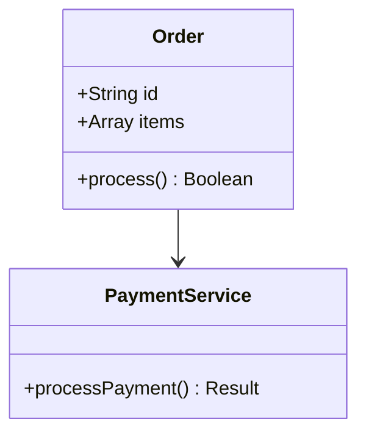

# 附录：实用工具和资源

本附录提供代码重构和质量提升相关的实用工具、资源和参考资料。

## 代码分析工具

### 1. 静态代码分析

**ESLint** - JavaScript代码检查
```bash
# 安装
npm install eslint --save-dev

# 配置
npx eslint --init

# 使用
npx eslint src/
npx eslint --fix src/  # 自动修复
```

**推荐的ESLint配置**
```json
{
  "extends": [
    "eslint:recommended",
    "plugin:prettier/recommended"
  ],
  "rules": {
    "complexity": ["error", 10],
    "max-lines": ["error", 500],
    "max-params": ["error", 5],
    "no-duplicate-imports": "error"
  }
}
```

**SonarQube** - 全面的代码质量平台
```yaml
# docker-compose.yml
version: '3.8'
services:
  sonarqube:
    image: sonarqube:community
    ports:
      - "9000:9000"
    environment:
      - SONAR_ES_BOOTSTRAP_CHECKS_DISABLE=true
```

### 2. 代码复杂度分析

**Plato** - JavaScript代码复杂度报告
```bash
npm install -g plato
plato -r -d report src/
```

**Metrics配置示例**
```javascript
// .platorc.js
module.exports = {
  complexity: {
    maxcyclomatic: 10
  },
  size: {
    maxloc: 500
  }
};
```

### 3. 重复代码检测

**jscpd** - JavaScript复制粘贴检测
```bash
npm install -g jscpd
jscpd src/ --min-lines 5 --min-tokens 30
```

## 重构工具

### 1. IDE重构支持

**VS Code重构快捷键**
- `F2` - 重命名符号
- `Ctrl+.` - 快速修复和重构
- `Ctrl+Shift+R` - 重构菜单
- `Alt+Shift+F` - 格式化文档

**WebStorm重构功能**
- Extract Method (Ctrl+Alt+M)
- Extract Variable (Ctrl+Alt+V)
- Inline Method (Ctrl+Alt+N)
- Move Method/Field (F6)

### 2. 自动化重构工具

**JSCodeshift** - JavaScript代码转换工具
```javascript
// 示例：重命名函数
module.exports = function(fileInfo, api) {
  const j = api.jscodeshift;
  
  return j(fileInfo.source)
    .find(j.FunctionDeclaration)
    .forEach(path => {
      if (path.value.id.name === 'oldName') {
        path.value.id.name = 'newName';
      }
    })
    .toSource();
};
```

## 测试工具

### 1. 单元测试框架

**Jest** - JavaScript测试框架
```javascript
// 安装
npm install --save-dev jest

// 配置 package.json
{
  "scripts": {
    "test": "jest",
    "test:coverage": "jest --coverage"
  }
}

// 示例测试
describe('OrderProcessor', () => {
  test('should process valid order', async () => {
    const processor = new OrderProcessor();
    const order = createTestOrder();
    
    const result = await processor.process(order);
    
    expect(result.success).toBe(true);
    expect(result.order.status).toBe('completed');
  });
});
```

### 2. 测试覆盖率工具

**Istanbul/NYC** - 代码覆盖率工具
```bash
npm install --save-dev nyc

# 运行测试并生成覆盖率报告
npx nyc npm test
npx nyc report --reporter=html
```

## 性能分析工具

### 1. 运行时性能分析

**Chrome DevTools Performance Tab**
- 录制和分析JavaScript性能
- 识别性能瓶颈
- 内存泄漏检测

**Node.js性能分析**
```bash
# 生成CPU分析文件
node --prof app.js
node --prof-process isolate-0xnnnnnnnnnnnn-v8.log > processed.txt

# 内存分析
node --inspect app.js
# 然后在Chrome DevTools中分析
```

### 2. 打包大小分析

**Webpack Bundle Analyzer**
```bash
npm install --save-dev webpack-bundle-analyzer

# 生成打包分析报告
npx webpack-bundle-analyzer dist/stats.json
```

**配置示例**
```javascript
const BundleAnalyzerPlugin = require('webpack-bundle-analyzer').BundleAnalyzerPlugin;

module.exports = {
  plugins: [
    new BundleAnalyzerPlugin({
      analyzerMode: 'static',
      openAnalyzer: false
    })
  ]
};
```

## 文档工具

### 1. API文档生成

**JSDoc** - JavaScript文档生成器
```javascript
/**
 * 处理用户订单
 * @param {Order} order - 订单对象
 * @param {Object} options - 处理选项
 * @returns {Promise<ProcessResult>} 处理结果
 * @throws {Error} 当订单无效时抛出错误
 */
async function processOrder(order, options = {}) {
  // 实现...
}
```

**配置示例**
```json
{
  "plugins": ["plugins/markdown"],
  "opts": {
    "template": "templates/default",
    "destination": "./docs/",
    "recurse": true
  }
}
```

### 2. 架构文档工具

**Mermaid** - 图表生成
````markdown

````

## 持续集成工具

### 1. GitHub Actions配置

```yaml
# .github/workflows/ci.yml
name: CI Pipeline
on: [push, pull_request]

jobs:
  test:
    runs-on: ubuntu-latest
    steps:
      - uses: actions/checkout@v2
      - uses: actions/setup-node@v2
        with:
          node-version: '16'
      - run: npm ci
      - run: npm run lint
      - run: npm run test
      - run: npm run build
      - run: npm run coverage
      
  quality:
    needs: test
    runs-on: ubuntu-latest
    steps:
      - uses: actions/checkout@v2
      - uses: actions/setup-node@v2
      - run: npm ci
      - run: npx eslint src/ --format junit --output-file eslint-results.xml
      - uses: codecov/codecov-action@v2
```

### 2. SonarQube集成

```yaml
# sonarcloud.yml
name: SonarCloud Analysis
on:
  push:
    branches: [main]
  pull_request:
    branches: [main]

jobs:
  sonarcloud:
    runs-on: ubuntu-latest
    steps:
      - uses: actions/checkout@v2
        with:
          fetch-depth: 0
      - name: SonarCloud Scan
        uses: SonarSource/sonarcloud-github-action@master
        env:
          GITHUB_TOKEN: ${{ secrets.GITHUB_TOKEN }}
          SONAR_TOKEN: ${{ secrets.SONAR_TOKEN }}
```

## 学习资源

### 1. 推荐书籍

**重构相关**
- 《重构：改善既有代码的设计》（Martin Fowler）
- 《代码整洁之道》（Robert C. Martin）
- 《修改代码的艺术》（Michael Feathers）

**设计模式**
- 《设计模式：可复用面向对象软件的基础》
- 《JavaScript设计模式》
- 《前端架构：从入门到微前端》

### 2. 在线课程

**免费资源**
- [Refactoring.Guru](https://refactoring.guru/) - 重构和设计模式指南
- [JavaScript Design Patterns](https://www.patterns.dev/) - JavaScript设计模式
- [Clean Code JavaScript](https://github.com/ryanmcdermott/clean-code-javascript)

**付费课程**
- Udemy: JavaScript设计模式和最佳实践
- Pluralsight: 高级JavaScript开发
- Frontend Masters: 软件架构基础

### 3. 社区资源

**博客和文章**
- [Martin Fowler's Blog](https://martinfowler.com/)
- [Eric Elliott's JavaScript Scene](https://medium.com/javascript-scene)
- [Addy Osmani's Blog](https://addyosmani.com/blog/)

**开源项目**
- [Clean Code JavaScript](https://github.com/ryanmcdermott/clean-code-javascript)
- [JavaScript Algorithms](https://github.com/trekhleb/javascript-algorithms)
- [Node.js Best Practices](https://github.com/goldbergyoni/nodebestpractices)

## 实用脚本和模板

### 1. 代码质量检查脚本

```javascript
// scripts/quality-check.js
const { execSync } = require('child_process');
const fs = require('fs');

class QualityChecker {
  constructor() {
    this.metrics = {};
  }
  
  runESLint() {
    try {
      const result = execSync('npx eslint src/ --format json', { encoding: 'utf8' });
      this.metrics.eslint = JSON.parse(result);
      return this.metrics.eslint;
    } catch (error) {
      console.error('ESLint检查失败:', error);
      return null;
    }
  }
  
  runTests() {
    try {
      const result = execSync('npm test -- --coverage --json', { encoding: 'utf8' });
      this.metrics.tests = JSON.parse(result);
      return this.metrics.tests;
    } catch (error) {
      console.error('测试运行失败:', error);
      return null;
    }
  }
  
  generateReport() {
    const report = {
      timestamp: new Date().toISOString(),
      metrics: this.metrics
    };
    
    fs.writeFileSync('quality-report.json', JSON.stringify(report, null, 2));
    console.log('质量报告已生成: quality-report.json');
  }
}

// 使用
const checker = new QualityChecker();
checker.runESLint();
checker.runTests();
checker.generateReport();
```

### 2. 重构计划模板

```markdown
# 重构计划: [组件名称]

## 当前问题
- [ ] 代码重复率: XX%
- [ ] 函数平均长度: XX行
- [ ] 类平均大小: XX行
- [ ] 圈复杂度: XX

## 重构目标
- [ ] 降低重复代码率至 < 5%
- [ ] 函数长度控制在 20 行以内
- [ ] 类大小控制在 500 行以内
- [ ] 圈复杂度降低至 < 10

## 实施步骤
1. **阶段一**: 代码分析 (预计: X天)
   - [ ] 静态代码分析
   - [ ] 复杂度测量
   - [ ] 重复代码识别

2. **阶段二**: 测试准备 (预计: X天)
   - [ ] 补充单元测试
   - [ ] 建立测试覆盖率基准
   - [ ] 准备回滚方案

3. **阶段三**: 重构实施 (预计: X天)
   - [ ] 提取重复代码
   - [ ] 拆分过大函数
   - [ ] 重构复杂条件逻辑

4. **阶段四**: 验证测试 (预计: X天)
   - [ ] 功能回归测试
   - [ ] 性能基准测试
   - [ ] 代码审查

## 风险控制
- **回滚计划**: [描述回滚策略]
- **测试策略**: [测试覆盖方案]
- **监控指标**: [关键性能指标]

## 成功标准
- [ ] 代码质量评分提升 XX%
- [ ] 测试覆盖率保持 XX%
- [ ] 性能指标无退化
```

## 总结

本附录提供的工具和资源将帮助您在实际开发中有效识别和修复代码坏味道。建议：

1. **逐步引入**：不要一次性引入所有工具，根据团队实际情况选择
2. **自动化集成**：将代码质量检查集成到CI/CD流程中
3. **持续学习**：定期关注新的工具和最佳实践
4. **团队协作**：建立统一的代码质量标准和工作流程

记住，工具只是辅助，真正的代码质量提升来自于开发者的意识和持续改进的文化。

---

**手册完结** - 希望这份《代码的坏味道》技术学习手册对您的开发工作有所帮助！