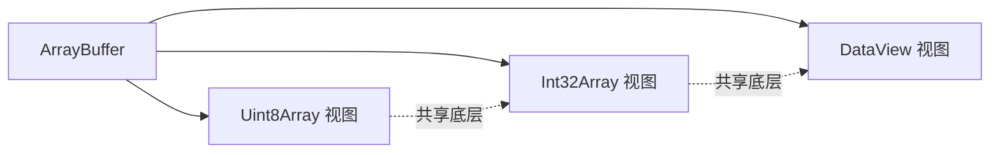
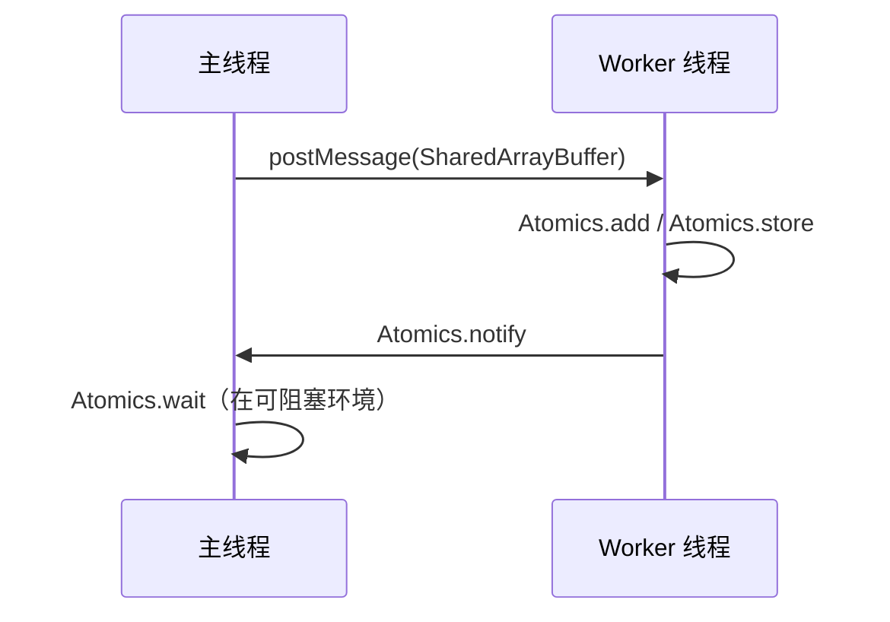

# 二进制与性能（ArrayBuffer/TypedArray/DataView/SharedArrayBuffer/Atomics）

本章聚焦 JavaScript 的二进制数据与并发内存模型：ArrayBuffer、TypedArray、DataView 的内存布局与读写，SharedArrayBuffer 与 Atomics 的并发原语，以及传输/拷贝与性能建议。

## 1. 核心概念

- ArrayBuffer：固定长度的原始二进制缓冲区（仅内存，不含读写方法）
- TypedArray：基于 ArrayBuffer 的类型化视图（如 Uint8Array、Float32Array），按定长与端序读写
- DataView：更灵活的视图，支持指定端序读写不同宽度的数值
- SharedArrayBuffer：可跨多个线程共享的缓冲区（配合 Atomics）
- Atomics：提供原子读写/修改/等待/通知等并发原语

## 2. 基础示例：ArrayBuffer 与 TypedArray

```js
// 创建 8 字节缓冲区
const buf = new ArrayBuffer(8);

// 基于同一缓冲区的不同类型视图
const u8 = new Uint8Array(buf);    // 8 个字节
const i32 = new Int32Array(buf);   // 2 个 32 位整数（共享同一底层内存）

u8[0] = 0xFF;
u8[1] = 0x01;

console.log(u8);  // Uint8Array(8) [255,1,0,0,0,0,0,0]
console.log(i32); // Int32Array(2) [511,0]（具体值依赖平台端序）
```

要点：
- 多个视图共享同一底层内存，更改一个视图会影响另一个视图的可见数据
- TypedArray 的长度与元素宽度相关（Int32Array 用 4 字节一个元素）

## 3. DataView 与端序（Endian）

多数平台是小端（Little Endian）。不同协议/文件可能要求大端序（Big Endian）。

```js
const buf = new ArrayBuffer(4);
const dv = new DataView(buf);

// 写入 0x12345678 为大端
dv.setUint32(0, 0x12345678, false); // false = Big Endian
console.log(dv.getUint32(0, false).toString(16)); // 12345678

// 小端读取将产生不同的数值
console.log(dv.getUint32(0, true).toString(16)); // 78563412
```

建议：
- 与外部协议交互（网络/文件）时明确端序
- 使用 DataView 进行跨宽度与端序的精细读写

## 4. 文本与二进制转换

```js
const enc = new TextEncoder();
const dec = new TextDecoder('utf-8');

const bytes = enc.encode('你好');     // Uint8Array
const str = dec.decode(bytes);        // '你好'
```

注意：
- TextEncoder/Decoder 适用于 UTF-8 编解码；若需其他编码请使用相应库

## 5. 共享内存与 Atomics（并发模型）

SharedArrayBuffer 允许多个线程共享同一内存；Atomics 提供原子性与等待/通知。

```js
// 主线程
const sab = new SharedArrayBuffer(4);      // 4 字节
const ia = new Int32Array(sab);
ia[0] = 0;

postMessage(sab); // 发送至 worker（传共享引用）

// Worker 线程
onmessage = (e) => {
  const ia = new Int32Array(e.data);
  // 原子加一
  Atomics.add(ia, 0, 1);
  // 通知等待者
  Atomics.notify(ia, 0, 1);
};

// 主线程等待示例（阻塞警告：仅在特定场景使用）
Atomics.wait(ia, 0, 0); // 当 ia[0] 为 0 时阻塞等待
console.log(ia[0]); // 1
```

要点与风险：
- Atomics.wait 是阻塞式（仅在可阻塞环境使用，浏览器主线程不可用）
- 使用 notify/wait 时需严格遵守内存布局与状态协议
- 安全要求：SharedArrayBuffer 在 Web 环境需启用跨源隔离（COOP/COEP），否则不可用

## 6. 传输（transfer）与拷贝（copy）

结构化克隆（structuredClone）支持零拷贝传输 ArrayBuffer（转移所有权）。

```js
const buf = new ArrayBuffer(1024);
const clone = structuredClone(buf, { transfer: [buf] });

console.log(buf.byteLength);   // 0（已转移，源失效）
console.log(clone.byteLength); // 1024（新所有者）
```

注意：
- SharedArrayBuffer 不能通过 transfer 转移（因共享语义）
- postMessage 在现代浏览器/Worker 环境亦支持 transfer 选项

## 7. 性能建议与常见陷阱

- 选择合适视图：批量数值计算用 TypedArray；复杂跨宽度/端序用 DataView
- 避免频繁创建视图：复用视图或切片（subarray）以降低分配成本
- 切片与拷贝：
  - TypedArray.subarray() 创建“视图切片”（零拷贝）；
  - TypedArray.slice() 创建“新副本”（拷贝）
- 与 GC 相关：
  - 大缓冲区生命周期长、与闭包/缓存关联时注意可达性，必要时显式释放引用
- SharedArrayBuffer/Atomics：
  - 设计清晰的状态机（使用特定索引存放状态，避免竞态）
  - 避免在 UI 主线程阻塞等待（会卡死界面）
- 端序误用：
  - 与外部协议交互时端序错误将导致数据解析异常；统一封装读写函数

## 8. 图示

内存视图关系（简化）：


并发共享与原子操作：


## 9. FAQ（本章）

- 为什么结构化克隆后源 ArrayBuffer 长度为 0？因为使用了 transfer 转移所有权。
- 何时用 DataView 而非 TypedArray？当需要混合宽度或指定端序时。
- SharedArrayBuffer 在浏览器不可用？需满足跨源隔离头（COOP/COEP）；或在安全受限环境不可用。
- for await...of 是否适合逐字节读取？不建议；按块读取更高效，再用视图解析。

## 10. 兼容与版本

- ArrayBuffer/TypedArray/DataView：ES2015+ 广泛支持（TypedArray 初始于 ES2015；早期前置于 ES5.1 相关草案）
- SharedArrayBuffer/Atomics：现代浏览器与 Node 支持，但 Web 需跨源隔离；旧环境不可用或受限

## 参考与扩展阅读

- ECMAScript：Binary Data、TypedArray、Atomics
- MDN：ArrayBuffer、TypedArray、DataView、SharedArrayBuffer、Atomics
- Web 安全头：COOP/COEP 与跨源隔离