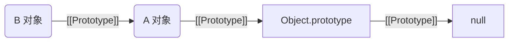
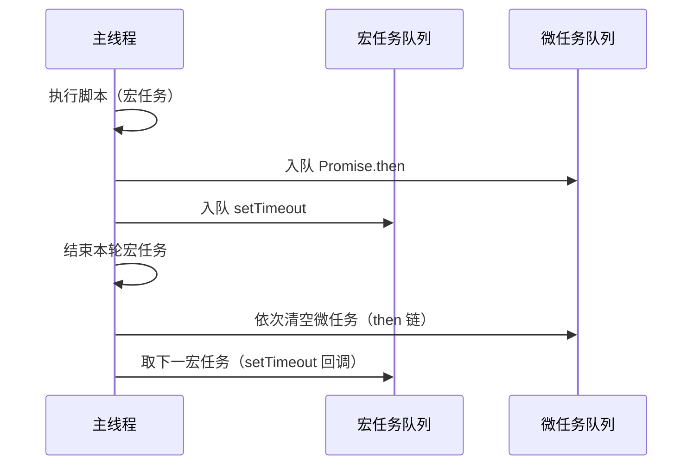

# 语言语义基础

本章系统梳理 JavaScript 的核心语义：作用域/提升/TDZ、this 绑定、原型与原型链、执行上下文与闭包、事件循环（微/宏任务）。每节包含概念要点、最小可复现示例、常见陷阱与兼容提示。

## 1. 作用域、提升与暂时性死区（TDZ）

要点：
- 作用域：词法作用域（静态作用域）由代码书写位置决定。
- 提升（Hoisting）：var 声明与函数声明在编译期提升；let/const 不提升到可用状态。
- TDZ：在 let/const 声明前访问变量会抛 ReferenceError。

示例：
```js
console.log(a); // undefined（var 提升，初始化为 undefined）
var a = 1;

console.log(b); // ReferenceError（TDZ）
let b = 2;

foo();           // 正常：函数声明提升
function foo() { console.log('ok'); }

// 函数表达式不会提升其初始化
bar();           // TypeError: bar is not a function
var bar = function() {};
```

陷阱与建议：
- 避免在声明前使用标识符；统一把声明放在使用前。
- 使用 const 优先表达不可变绑定；对对象内部可变性需单独管理。

兼容与版本：ES2015(ES6) 引入 let/const 与 TDZ 语义，现代运行时均支持。

## 2. this 绑定与常见误区

要点：
- 绑定规则优先级：new > 显式绑定（call/apply/bind）> 隐式绑定（对象调用）> 默认绑定（非严格模式下指向全局，严格模式下为 undefined）。
- 箭头函数：不绑定 this，捕获外层词法 this。

示例：
```js
const obj = {
  x: 42,
  m() { console.log(this.x); }
};

obj.m(); // 42（隐式绑定）

const unbound = obj.m;
unbound(); // 严格模式：undefined（默认绑定）

const bound = obj.m.bind(obj);
bound(); // 42（显式绑定）

function Ctor() { this.y = 7; }
const i = new Ctor();
console.log(i.y); // 7（new 绑定）

// 箭头函数示例
const counter = {
  val: 0,
  inc() {
    setTimeout(() => {
      this.val++;
      console.log(this.val); // this 来自 inc 的词法外层
    }, 0);
  }
};
counter.inc();
```

陷阱与建议：
- 事件回调/计时器中使用箭头函数，可避免 this 丢失。
- 使用 class 时，给实例方法绑定 this 可用箭头或在构造函数中绑定。

## 3. 原型与原型链

要点：
- 每个对象都有内部 [[Prototype]] 指向另一个对象或 null。
- 属性访问会沿原型链向上查找，直到命中或到达 null。
- class 是原型语法糖：实例方法在原型上，静态方法在构造函数上。

示例：
```js
const A = { a: 1 };
const B = Object.create(A); // B.[[Prototype]] -> A
B.b = 2;

console.log(B.a); // 1（原型链查找）
console.log(B.hasOwnProperty('a')); // false
console.log('a' in B); // true

class Foo {
  static s() { return 'static'; }
  m() { return 'method'; }
}
const f = new Foo();
console.log(f.m());     // 'method'
console.log(Foo.s());   // 'static'
```

图示（原型链指向关系）：


陷阱与建议：
- 过长原型链会增加查找成本；性能敏感场景优先使用自有属性。
- 避免修改内建原型（如 Array.prototype），影响全局行为。

## 4. 执行上下文与闭包

要点：
- 执行上下文（Execution Context）包含变量环境、词法环境与 this 绑定。
- 闭包（Closure）：函数捕获并保留其词法作用域中的绑定。

示例（经典闭包与 for 循环）：
```js
function makeCounter() {
  let c = 0;
  return () => ++c;
}
const next = makeCounter();
console.log(next()); // 1
console.log(next()); // 2

// 使用 let 保留块级作用域
const fns = [];
for (let i = 0; i < 3; i++) {
  fns.push(() => i);
}
console.log(fns.map(fn => fn())); // [0,1,2]

// var 会共享同一函数级作用域，导致闭包读取同一最终值
const gns = [];
for (var j = 0; j < 3; j++) {
  gns.push(() => j);
}
console.log(gns.map(fn => fn())); // [3,3,3]
```

陷阱与建议：
- 闭包可能导致被捕获对象长期可达而无法 GC；注意清理定时器/监听器与缓存。
- 对大型对象或频繁更新的状态，使用弱引用结构（如 WeakMap）或显式取消引用。

## 5. 事件循环与微/宏任务

要点：
- 宏任务（Macrotask）：setTimeout、setInterval、I/O、UI 事件、脚本初始执行。
- 微任务（Microtask）：Promise.then/catch/finally、queueMicrotask、MutationObserver。
- 每轮事件循环处理一个宏任务后立即清空微任务队列。

时序示例：
```js
console.log('A');

setTimeout(() => console.log('macro'), 0);

Promise.resolve().then(() => console.log('micro-1'))
                 .then(() => console.log('micro-2'));

console.log('B');
// 输出顺序：A, B, micro-1, micro-2, macro
```

时序图（简化）：


陷阱与建议：
- 长微任务链可能阻塞后续宏任务；适度分批（如使用 setTimeout 0 或 queueMicrotask 分段）。
- Node 与浏览器在队列细节上存在差异，注意版本行为与 unhandledrejection 处理。

兼容与版本：Promise 微任务与事件循环模型在现代浏览器与 Node 已稳定；旧环境需谨慎。

## FAQ（本章）
- 为什么箭头函数内的 this 不指向调用者？因为其捕获定义处的词法 this，不进行动态绑定。
- 为什么 for...of 能遍历数组值而 for...in 遍历键？因为 for...of 基于迭代协议，for...in 基于可枚举属性。
- Promise 回调为何优先于 setTimeout？因为 then 在微任务队列，setTimeout 在宏任务队列。

## 参考与扩展阅读
- ECMAScript 语言规范（ECMA-262）
- Jake Archibald: Tasks, microtasks, queues and schedules
- MDN: Closures、Prototypal inheritance、Event loop

## 兼容与版本
- ES2015：let/const、箭头函数、class、Promise 与微任务
- ES2016+：细节增强与新 API
- Node/浏览器具体版本：请参阅各环境兼容矩阵与 Babel/polyfill 指南