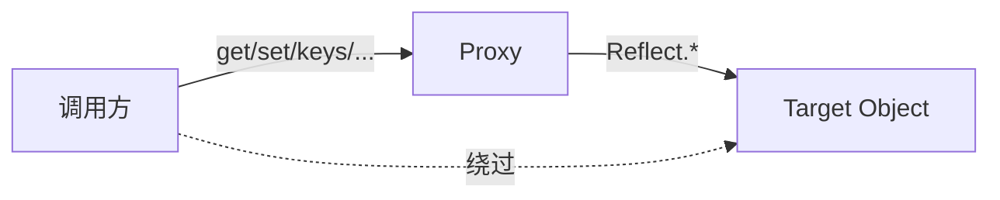

# 元编程与反射（Proxy/Reflect/属性描述符/冻结）

本章系统梳理 JavaScript 的元编程能力：属性描述符、对象可扩展性与冻结、Proxy 拦截点、Reflect 反射 API 以及二者的配合模式。提供最小可复现示例、常见陷阱与图示。

## 1. 属性描述符与对象可扩展性

要点：
- 属性描述符（Property Descriptor）定义了属性的数据/访问器特性：
  - 数据描述符：value、writable、enumerable、configurable
  - 访问器描述符：get、set、enumerable、configurable
- 对象可扩展性：
  - Object.preventExtensions(obj)：禁止新增属性
  - Object.seal(obj)：禁止新增/删除属性，且把所有现有属性 configurable 设为 false
  - Object.freeze(obj)：在 seal 基础上还将所有数据属性 writable 设为 false（深层需手动递归）

示例（描述符与冻结）：
```js
const o = {};
Object.defineProperty(o, 'x', { value: 1, writable: false, enumerable: true, configurable: false });

console.log(Object.getOwnPropertyDescriptor(o, 'x'));
// { value: 1, writable: false, enumerable: true, configurable: false }

console.log(Object.isExtensible(o)); // true
Object.preventExtensions(o);
console.log(Object.isExtensible(o)); // false

const p = { a: 1, b: { c: 2 } };
Object.freeze(p);
p.a = 10; // 静默失败或严格模式下抛错
p.b.c = 3; // 注意：浅冻结，嵌套对象仍可变
```

建议：
- 库/SDK 的稳定公开 API 可使用冻结保护不可变接口表面（浅冻结 + 只读文档约定）。
- 需要不可变深结构时，采用结构共享的不可变数据方案或递归冻结（成本较高）。

## 2. Proxy 代理：拦截与自定义对象语义

要点：
- Proxy(target, handler) 返回一个代理对象，可拦截 13 类基本操作（部分环境实现细节可能略有差异）：
  - get、set、has、deleteProperty、ownKeys
  - getOwnPropertyDescriptor、defineProperty
  - getPrototypeOf、setPrototypeOf
  - isExtensible、preventExtensions
  - apply（函数调用）、construct（new 调用）
- 代理与目标对象共享原型链可见性，但语义由 handler 控制；invariant（不变量）要求必须满足（否则抛 TypeError）。

最小示例（拦截 get/set）：
```js
const target = { x: 1 };
const proxy = new Proxy(target, {
  get(t, k, r) {
    console.log('get', k);
    return Reflect.get(t, k, r); // 建议使用 Reflect 保持语义一致
  },
  set(t, k, v, r) {
    console.log('set', k, v);
    return Reflect.set(t, k, v, r);
  }
});

proxy.x;     // get x
proxy.y = 2; // set y 2
console.log(target.y); // 2
```

只读视图示例（拒绝写入）：
```js
function readonly(obj) {
  return new Proxy(obj, {
    set() { return false; }, // 严格模式下将抛 TypeError
    defineProperty() { return false; },
    deleteProperty() { return false; }
  });
}
const cfg = readonly({ host: 'localhost' });
cfg.host = '127.0.0.1'; // 严格模式下 TypeError
```

invariant 与坑：
- 若目标对象属性是不可配置且不可写，则 get 拦截返回值必须等于实际值；否则违反不变量抛错。
- preventExtensions/setPrototypeOf 等拦截必须与目标当前状态一致，不能“撒谎”。

## 3. Reflect 反射：与 Proxy 的天然搭配

要点：
- Reflect 提供与 Proxy 拦截点一一对应的静态方法，返回布尔或值，不抛或少抛（与 Object.* 行为不同处）。
- 在 Proxy handler 内使用 Reflect 保持默认行为并便于精确组合。

常用 API：
- Reflect.get/Reflect.set/Reflect.has/Reflect.deleteProperty
- Reflect.getOwnPropertyDescriptor/Reflect.defineProperty
- Reflect.ownKeys
- Reflect.getPrototypeOf/Reflect.setPrototypeOf
- Reflect.isExtensible/Reflect.preventExtensions
- Reflect.apply/Reflect.construct

示例（访问日志 + 只读属性保护）：
```js
function withAccessLog(obj) {
  return new Proxy(obj, {
    get(t, k, r) {
      console.debug('[read]', String(k));
      return Reflect.get(t, k, r);
    },
    set(t, k, v, r) {
      if (String(k).startsWith('_')) return false;
      return Reflect.set(t, k, v, r);
    }
  });
}
const user = withAccessLog({ name: 'Alice', _id: 100 });
user.name;    // [read] name
user._id = 1; // false（严格模式下抛错）
```

建议：
- 优先以“最小覆盖”原则编写 handler：仅拦截需要改变的语义，其余通过 Reflect 透传。
- 组合多个语义时，以管道化/装饰器风格叠加多个代理，便于维护与测试。

## 4. 构造与函数调用拦截：construct/apply

示例（构造参数校验 + 函数调用埋点）：
```js
const C = class { constructor(x) { this.x = x; } };
const Cx = new Proxy(C, {
  construct(t, args, newTarget) {
    if (args.length !== 1 || typeof args[0] !== 'number') {
      throw new TypeError('C requires a single number');
    }
    return Reflect.construct(t, args, newTarget);
  }
});

function sum(a, b) { return a + b; }
const sumTraced = new Proxy(sum, {
  apply(t, thisArg, args) {
    console.time('sum');
    const res = Reflect.apply(t, thisArg, args);
    console.timeEnd('sum');
    return res;
  }
});

console.log(new Cx(1).x); // 1
console.log(sumTraced(1, 2)); // 打印耗时
```

## 5. ownKeys 与对象视图

场景：隐藏内部字段、虚拟属性、排序 keys。
```js
const store = { a: 1, _secret: 42 };
const view = new Proxy(store, {
  ownKeys(t) { // 影响 Object.keys/Reflect.ownKeys 等
    return Reflect.ownKeys(t).filter(k => !String(k).startsWith('_'));
  },
  get(t, k, r) {
    if (k === 'size') return Reflect.ownKeys(t).length - 1; // 虚拟只读属性
    return Reflect.get(t, k, r);
  }
});

console.log(Object.keys(view)); // ['a']
console.log(view.size); // 1
```

不变量注意：
- ownKeys 的返回需要与目标对象属性配置一致：不可配置的键必须包含在列表里，否则抛错。

## 6. 与不可扩展/冻结对象的交互

要点：
- 当目标被 preventExtensions/seal/freeze 后，相关拦截的返回值必须与目标真实状态一致（例如 isExtensible 返回 false）。
- defineProperty 必须遵守不可配置/只读约束。

示例（一致性）：
```js
const t = {};
Object.preventExtensions(t);
const p = new Proxy(t, {
  isExtensible() { return false; },          // 必须匹配
  defineProperty() { return false; }         // 拒绝新增
});
Reflect.isExtensible(p); // false
```

## 7. 图示

Proxy/Reflect 与对象操作关系（简化）：


Proxy 拦截点总览（概念图）：
```mermaid
graph TD
get --> value
set --> assign
apply --> "函数调用()"
construct --> "new 调用"
ownKeys --> keys
defineProperty --> "属性定义"
getOwnPropertyDescriptor --> desc
getPrototypeOf --> proto
setPrototypeOf --> setProto
isExtensible --> extensible
preventExtensions --> lock
deleteProperty --> del
```

## 8. 常见陷阱与建议

- 违反不变量导致 TypeError：如冻结对象属性的 get 返回值与真实值不一致。
- 代理链与内存泄漏：避免长期持有闭包中大对象引用；必要时弱引用结构辅助缓存。
- 调试困难：代理隐藏真实访问路径；开发期加入可开关的日志或使用 dev-only 代理。
- 性能成本：Proxy 在高频路径（热循环、渲染关键路径）可能产生额外开销；评估再用。
- JSON 序列化：Proxy 默认按目标对象序列化，但某些定制 ownKeys/descriptor 可能影响可见属性。

## 9. 兼容与版本

- Proxy/Reflect：ES2015 起支持；老旧环境需降级策略（无法完全 polyfill Proxy 语义）。
- 描述符与可扩展性：ES5 起支持，现代环境稳定。

## 10. FAQ（本章）

- 为什么我的 get 陷阱返回值与实际值不同会报错？可能违反了不变量（如不可配置且不可写的属性）。
- 何时优先使用 Reflect？在 handler 内实现默认行为或组合行为时，Reflect 能提供一致返回与更少异常。
- Proxy 能否做响应式？可以，但需权衡性能与陷阱；框架（如 Vue3）已有成熟实践与边界处理。