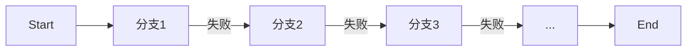

# 正则全面指南（ES2018+ 增强）

本章系统梳理现代 JavaScript 正则特性：命名捕获、后行断言、dotAll、Unicode 属性类、黏连标志 y、Unicode 模式 u/v 与性能回溯陷阱，并提供可复制示例与兼容策略。

## 1. 命名捕获组 `(?<name>...)`
要点：
- 通过 groups.name 读取命名组；replace 支持 `$<name>` 引用
```js
const re = /(?<user>[a-z]+)@(?<host>[\w.]+)/i;
const m = 'Alice@example.com'.match(re);
console.log(m.groups.user, m.groups.host); // Alice example.com

console.log('2025-10-14'.replace(
  /(?<y>\d{4})-(?<m>\d{2})-(?<d>\d{2})/,
  '$<m>/$<d>/$<y>'
)); // 10/14/2025
```
兼容：ES2018 起。旧环境可回退为位置组并在 replace 中手动重排。

## 2. 断言：后行断言 `(?<=...)` 和 否定后行 `(?<!...)`
要点：
- 后行断言匹配前面是/不是某模式的位置，不消耗字符
```js
console.log('€199 $299'.match(/(?<=€)\d+/g)); // ["199"]
console.log('foo.js bar.ts'.match(/\w+(?<!\.ts)\b/g)); // ["foo"]
```
兼容：ES2018 起。旧环境需改写为分组匹配并后处理。

## 3. dotAll 模式 s：让 . 匹配换行
```js
console.log(/.^.$/.test('\n'));      // false（默认 . 不匹配换行）
console.log(/.^.$/s.test('\n'));     // true（s 模式）
console.log('a\nb'.match(/a.*b/s));  // ["a\nb"]
```
注意：使用 s 可简化 [\s\S] 写法，提高可读性。

## 4. Unicode 属性类 \p{...} 与 \P{...}
要点：
- 结合 u 标志，可按字符属性匹配（如 Letter、Number、Script 等）
```js
console.log(/\p{Letter}+/u.test('Москва')); // true（西里尔）
console.log('3Ⅳ四'.match(/\p{Number}+/gu)); // ["3","Ⅳ","四"]
// 指定脚本
console.log('abcΚα'.match(/\p{Script=Greek}+/gu)); // ["Κα"]
```
常用属性：Letter、Number、Punctuation、Emoji、Script=Han/Latin/Greek、ASCII、ID_Start/ID_Continue 等。

## 5. 黏连标志 y 与 全局标志 g
要点：
- g：从 lastIndex 开始“尝试”匹配；y：要求从 lastIndex “必须”匹配
```js
const reG = /\d/g, reY = /\d/y;
const s = '1a2';
reG.lastIndex = reY.lastIndex = 1;
console.log(reG.exec(s)?.[0]); // "2"（跳过 a 后继续）
console.log(reY.exec(s));      // null（位置 1 不是数字则失败）
```
场景：词法扫描器、严格逐段匹配时优先 y，避免隐式回溯。

## 6. Unicode 模式 u 与 v（差异简述）
- u：启用 Unicode 语义，使转义、字符类、量词更符合 Unicode（必须与 \p{} 搭配）
- v：提案/新标准（支持更强的字符集运算、类减法等）；视运行时支持情况使用
建议：常规文本国际化匹配使用 u；对 v 的使用需特性检测。

## 7. 性能与回溯陷阱
- 灾难性回溯：含大量可选分支与重复量词的嵌套会导致指数级回溯
```js
// 避免 (a|aa)+?a 这类组合在长串 a...a 上的回溯
const bad = /^(a+)+$/;
console.time('bad'); console.log(bad.test('a'.repeat(5000))); console.timeEnd('bad');
```
优化建议：
- 使用原子组/占有量词（若运行时支持，或以等价改写）减少回溯
- 改写为更确定的结构（前缀/锚点/分组重构）
- 对大输入分段处理；必要时先做粗过滤（indexOf、长度范围等）

回溯示意（简化）：


## 8. 常见模式与最佳实践
- 行/字符串锚点：^ $ 与 m 标志（多行）
- 单词边界：\b 不总是适用于 Unicode 语言，考虑 \p{Letter} 边界或分词方案
- 安全：从不执行不可信的“动态构造”正则而不做转义
- 可读性：使用命名捕获、x 风格注释（通过分行拼接与注释变量）提高可维护性

## 9. 兼容与降级策略
- 命名捕获、后行断言、dotAll、\p{}：ES2018 起，旧环境可通过 Babel (transform-named-capturing-groups-regex 等) + runtime/polyfill 方案降级
- 属性类与脚本匹配不支持时：回退库（如 XRegExp）或业务侧白名单

## 10. FAQ（本章）
- 为什么 \b 在中文上效果异常？\b 基于 ASCII 单词边界；使用 \p{Letter} 或分词更稳妥
- 如何避免灾难性回溯？减少含歧义的重复分支，使用锚点/原子化改写/分段匹配
- \p{} 报错？确认加了 u 标志，且运行时支持 ES2018

## 参考
- ECMAScript RegExp 章节（ES2018+）
- MDN：Named capturing groups、Lookbehind、dotAll、Unicode property escapes
- run-time 兼容：core-js、Babel regex transforms