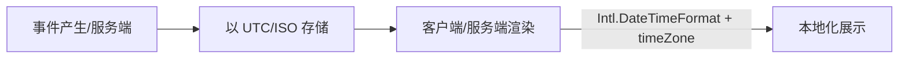
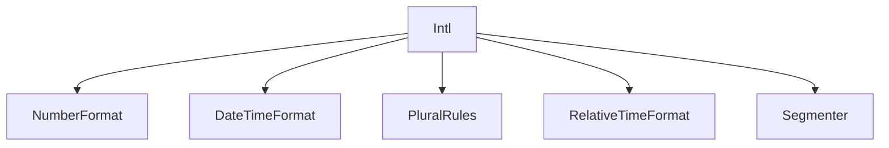

# 时间与国际化（Intl.* / Temporal 对比）

本章系统介绍国际化 API（Intl.*）与新一代时间 API 提案（Temporal），覆盖数字/日期时间/复数规则/相对时间/分词、时区与历法、常见陷阱与兼容策略。

## 1. Locale 与语言标记基础
- BCP 47 语言标记：如 zh-CN、en-US、ja-JP-u-ca-japanese（含 Unicode 扩展键）
- Intl API 通常接受 locales（字符串或数组）与 options（配置对象）；实现可能回退到最接近可用的语言/区域

检测与回退：
```js
const locales = ['zh-CN', 'en-US'];
const nf = new Intl.NumberFormat(locales, { style: 'currency', currency: 'CNY' });
console.log(nf.resolvedOptions()); // 查看实际采用的 locale 与选项
```

## 2. 数字与货币：Intl.NumberFormat
```js
// 货币
new Intl.NumberFormat('zh-CN', { style: 'currency', currency: 'CNY' }).format(1234.5);
// "￥1,234.50"

// 百分比与小数位
new Intl.NumberFormat('en-US', { style: 'percent', maximumFractionDigits: 1 }).format(0.1234);
// "12.3%"
```
要点：
- currency 需指定 ISO 4217 代码（CNY/USD/EUR）
- useGrouping、minimum/maximumFractionDigits 控制分组与小数

## 3. 日期与时间：Intl.DateTimeFormat
```js
const dtf = new Intl.DateTimeFormat('zh-CN', {
  dateStyle: 'long', timeStyle: 'short', timeZone: 'Asia/Shanghai'
});
console.log(dtf.format(new Date()));
```
自定义字段：
```js
new Intl.DateTimeFormat('en-GB', {
  year: 'numeric', month: '2-digit', day: '2-digit',
  hour: '2-digit', minute: '2-digit', hour12: false,
  timeZone: 'UTC', calendar: 'iso8601'
}).format(new Date());
```
要点：
- timeZone 控制格式化时区；与系统本地时区无关
- calendar 可选：iso8601、gregory、japanese、buddhist 等（环境支持视实现）

## 4. 复数规则：Intl.PluralRules
```js
const pr = new Intl.PluralRules('en', { type: 'cardinal' });
const suffix = count => ({ one: `${count} item`, other: `${count} items` })[pr.select(count)];
console.log(suffix(1)); // "1 item", suffix(2); // "2 items"
```
要点：
- type: "cardinal"（基数）|"ordinal"（序数）
- 与消息格式库（如 MessageFormat）配合构建多语言文案

## 5. 相对时间：Intl.RelativeTimeFormat
```js
const rtf = new Intl.RelativeTimeFormat('zh-CN', { numeric: 'auto' });
console.log(rtf.format(-1, 'day')); // "昨天"
console.log(rtf.format(2, 'hour')); // "后天"（不同语言行为略异）
```
单位：year/month/week/day/hour/minute/second

## 6. 文本分词：Intl.Segmenter
```js
const seg = new Intl.Segmenter('ja', { granularity: 'word' });
console.log([...seg.segment('これはペンです。')].map(s => s.segment));
// 根据语言规则获得更自然的词边界
```
要点：
- granularity: "grapheme" | "word" | "sentence"
- 对 CJK 场景的简单分词很有帮助（非严格 NLP）

## 7. 时区、DST 与常见陷阱
- 夏令时（DST）导致“缺失/重复”的本地时间；避免以本地时区计算跨日/跨季节的差值
- 建议：
  - 存储使用 UTC（ISO 8601），展示使用目标时区 Intl.DateTimeFormat
  - 差值/加减时间用稳定 API（见 Temporal 小节）

## 8. Temporal（提案）对比 Date（概念与示例）
Temporal 旨在修复 Date 的诸多缺陷（时区/不可变/精度/算术），核心类型：
- PlainDate / PlainTime / PlainDateTime：不含时区的“日历时间”
- ZonedDateTime：带时区的绝对时间
- Instant：时间线上的瞬间（UTC 纳秒）
对比示例（伪示例，需运行时支持 Temporal 或 polyfill）：
```js
// 以 ISO 字符串与时区构造
const zdt = Temporal.ZonedDateTime.from({ year: 2025, month: 10, day: 14, timeZone: 'Asia/Shanghai' });
// 加减更直观且不受 DST 陷阱影响
const plus = zdt.add({ days: 1, hours: 2 });
// 与 Instant/UTC 转换
const inst = plus.toInstant();
```
注意：
- Temporal 仍处于提案阶段，需确认运行时支持或引入 polyfill
- API 设计不可变，支持精确算术与明确的时区/日历语义

## 9. 兼容与降级策略
- Intl.* 在现代浏览器与 Node 普遍可用，但 Segmenter/RelativeTimeFormat 在旧环境可能缺失
- 使用特性检测：
```js
if (typeof Intl !== 'undefined' && Intl.RelativeTimeFormat) { /* ... */ }
```
- Polyfill：根据需求引入 @formatjs/intl 系列或 core-js 对应填充
- Temporal：使用 @js-temporal/polyfill 或后备方案

## 10. 性能与最佳实践
- 复用格式化器实例：在高频格式化场景下缓存 Intl.NumberFormat/DateTimeFormat 等实例
- 批量处理时避免在循环中重复 new Intl.*
- 明确 locales 与 options，减少回退成本与结果不确定性

## 11. 图示

时间存储与展示流程（建议）：


Intl API 家族（简化）：


## 12. FAQ（本章）
- 为什么同一时间在不同地区显示不同？展示使用的时区不同；存储用 UTC，展示用 Intl.DateTimeFormat 指定 timeZone。
- add 天数后“跨越 DST”结果异常？避免用本地 Date 算术；用 Temporal（或可靠库）进行日历算术。
- 货币小数位不正确？确保使用 style:'currency' 且 currency 指定为目标币种，必要时设置最小/最大小数位。

## 参考
- ECMA-402（Intl 标准）
- MDN：Intl.* 家族文档
- Temporal 提案与 @js-temporal/polyfill