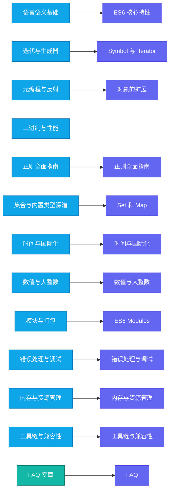

# 主题导航（草案）

本页为双维导航的主题入口草案。现阶段仅提供分组说明与现有章节映射，后续会逐步补齐专章。

## A. 语言语义基础
- 作用域/提升/TDZ、this 绑定、原型链、执行上下文与闭包、事件循环（微/宏任务）
- 现有相关：ES6 核心特性若干章节

## B. 迭代与生成器
- 迭代协议、可迭代对象、Generator、yield*、异步迭代 for await...of
- 现有相关：Symbol 与 Iterator（待拆分与扩展）

## C. 元编程与反射
- Proxy、Reflect、属性描述符、冻结/不可扩展
- 现有相关：对象扩展（后续补完）

## D. 二进制与性能
- ArrayBuffer/TypedArray/DataView、SharedArrayBuffer/Atomics

## E. 正则全面指南
- 命名捕获、后行断言、dotAll、Unicode 属性类

## F. 集合与内置类型深潜
- Map/Set/WeakMap/WeakSet、Object vs Map、API 全景与复杂度提示
- 现有相关：Set 和 Map（待加深）

## G. 时间与国际化
- Intl.* 全景、Temporal（提案）与 Date 对比

## H. 数值与大整数
- BigInt 与 Number 交互、精度/序列化、Math 扩展

## I. 模块与打包
- 动态 import()、import.meta、CJS/ESM 互操作、Tree-shaking 与 sideEffects
- 现有相关：ES6 Modules（待扩展）

## J. 错误处理与调试
- 同/异步错误、unhandledrejection、Error cause/stack、调试策略

## K. 内存与资源管理
- WeakRef/FinalizationRegistry、可达性与 GC 语义

## L. 工具链与兼容性
- TC39 流程/阶段、Babel 配置、polyfill 策略、支持矩阵

## M. FAQ 专章
- 跨主题常见问题与反模式（详见 FAQ）

提示：本页为导航草案，随着专章完善将逐步补充跳转链接与对照矩阵。

## 导航示意图（统一配色）

说明：
- 颜色规范：primary 用于分组节点，secondary 用于具体章节映射，accent 用于 FAQ/重要节点。
- 后续将把各节点链接到对应文档页面。

### 快速链接
- 语言语义基础 → ES6 核心特性起步示例：/guide/es6-let-const
- 迭代与生成器 → Symbol 与 Iterator：/guide/es6-symbol-iterator
- 元编程与反射 → 对象的扩展：/guide/es6-object-extensions
- 二进制与性能：/guide/binary-performance
- 正则全面指南：/guide/regex-guide
- 集合与内置类型深潜 → Set 和 Map：/guide/es6-set-map
- 时间与国际化：/guide/time-i18n
- 数值与大整数：/guide/numbers-bigint
- 模块与打包 → ES6 Modules：/guide/es6-modules
- 错误处理与调试：/guide/error-debugging
- 内存与资源管理：/guide/memory-resource
- 工具链与兼容性：/guide/tooling-compat
- 主题总览：/guide/topics-overview
- 术语词汇表：/guide/glossary
- 风格指南：/guide/style-guide
- FAQ：/guide/faq