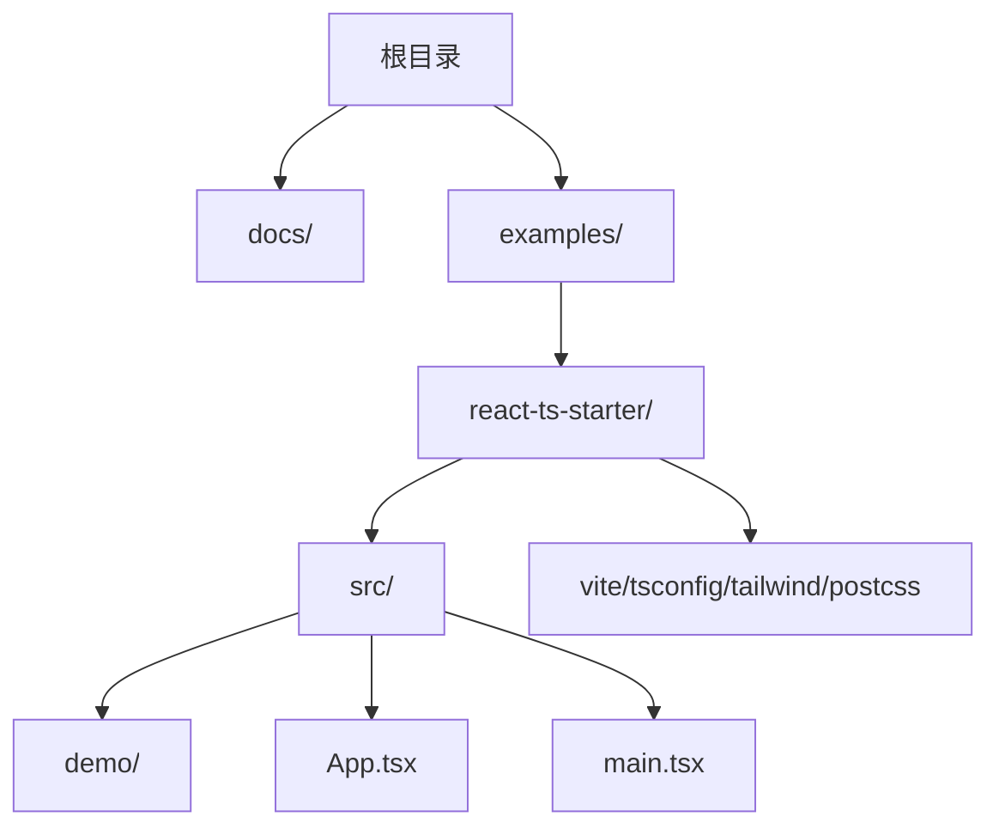
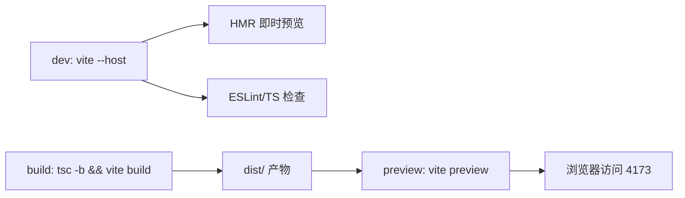

# 第0章：阅读指南与环境准备

> 导读  
> 本章帮助你快速搭建与本小册一致的开发环境与工程规范：Node 版本、包管理器、Vite + React + TypeScript、Tailwind、TDesign（含 Less 主题）、PostCSS/Autoprefixer、TS 配置、Vite 服务与 allowedHosts、以及 ESLint/Prettier/Husky。一旦完成，你即可顺畅运行随书示例并复现章节代码。

## 学习目标
- 明确运行环境与工具链版本要求，完成脚手架搭建
- 正确配置 TypeScript（jsx/react-jsx、verbatimModuleSyntax=false 等）
- 接入 Tailwind 与 TDesign，并开启 Less 主题定制能力
- 统一工程规范（ESLint + Prettier + Git hooks）与目录结构
- 熟悉常见故障的定位与快速排查

---

## 0.1 环境要求与建议
- Node：v18+（推荐 v20 或以上），npm 8+（或 pnpm 8+/yarn 1.x）
- 包管理器：任选其一（本文示例以 npm 为例）
- IDE：VS Code + 插件（ESLint、Prettier、Tailwind CSS IntelliSense）
- 浏览器：Chrome/Edge 最新版，开启 DevTools

验证版本：
```bash
node -v
npm -v
```

---

## 0.2 初始化项目（Vite + React + TS）
使用 Vite 5 脚手架创建 React-TS 项目（若已有仓库可跳过）：
```bash
npm create vite@5 react-ts-starter -- --template react-ts
cd react-ts-starter
```

安装依赖（固定版本，确保与随书示例一致）：
```bash
npm i -D vite@5 typescript@5 tailwindcss@3.4.17 postcss@8.5 autoprefixer@^10.4.20 less@4.3.0
npm i tdesign-react@1.12.0 tdesign-icons-react@0.5.0 react-icons lucide-react recharts
```

---

## 0.3 Tailwind 与 PostCSS 配置
初始化 Tailwind：
```bash
npx tailwindcss init -p
```

tailwind.config.js（关键是 content 路径）：
```js
/** @type {import('tailwindcss').Config} */
export default {
  content: ['./index.html', './src/**/*.{ts,tsx}'],
  theme: { extend: {} },
  plugins: [],
}
```

src/index.css 注入基础层：
```css
@tailwind base;
@tailwind components;
@tailwind utilities;
```

postcss.config.js：
```js
export default {
  plugins: {
    tailwindcss: {},
    autoprefixer: {},
  },
}
```

---

## 0.4 引入 TDesign 与 Less 主题能力
在入口中使用组件前，需引入少量公共样式：
```tsx
// main.tsx
import 'tdesign-react/esm/style/index.js';
```

Vite 配置启用 Less 预处理（可做主题变量覆盖）：
```ts
// vite.config.ts
import { defineConfig } from 'vite'
import react from '@vitejs/plugin-react'

export default defineConfig({
  plugins: [react()],
  css: {
    preprocessorOptions: {
      less: {
        javascriptEnabled: true,
        // 示例：自定义按钮高度
        // modifyVars: { '@btn-height-default': '40px' },
      },
    },
  },
  server: {
    host: '0.0.0.0',
    allowedHosts: true,
  },
})
```

快速验证（在 App.tsx 放一个按钮）：
```tsx
import { Button, Typography } from 'tdesign-react';

export default function App() {
  return (
    <div className="p-6">
      <Typography.Title level="h2">环境已就绪</Typography.Title>
      <Button theme="primary" className="mt-3">TDesign Button</Button>
    </div>
  );
}
```

---

## 0.5 TypeScript 配置要点
使用 Vite + React 需确保 TS 正确识别 JSX、模块互操作等：

tsconfig.app.json（建议单独存在并被 tsconfig.json 引用）：
```json
{
  "extends": "./tsconfig.json",
  "compilerOptions": {
    "jsx": "react-jsx",
    "esModuleInterop": true,
    "allowSyntheticDefaultImports": true,
    "verbatimModuleSyntax": false,
    "noUnusedLocals": false,
    "noUnusedParameters": false
  },
  "include": ["src"]
}
```

注意事项：
- jsx: react-jsx 以启用新 JSX 转换
- esModuleInterop/allowSyntheticDefaultImports 解决默认导入兼容性
- verbatimModuleSyntax: false 以符合常规导入写法
- 导入本地文件时不带 .tsx 后缀（避免 allowImportingTsExtensions 报警）

---

## 0.6 脚本与本地运行
在 package.json 添加常用脚本（若 Vite 模板已包含可跳过）：
```json
{
  "scripts": {
    "dev": "vite --host 0.0.0.0",
    "build": "tsc -b && vite build",
    "preview": "vite preview --host 0.0.0.0"
  }
}
```

运行：
```bash
npm run build
npm run preview
# 打开终端输出的 Local: http://localhost:4173/
```

---

## 0.7 ESLint、Prettier 与 Git Hooks
安装并初始化（示例）：
```bash
npm i -D eslint prettier eslint-config-prettier eslint-plugin-react eslint-plugin-react-hooks @typescript-eslint/parser @typescript-eslint/eslint-plugin
```

.eslintrc.cjs：
```js
module.exports = {
  root: true,
  parser: '@typescript-eslint/parser',
  plugins: ['@typescript-eslint', 'react', 'react-hooks'],
  extends: [
    'eslint:recommended',
    'plugin:@typescript-eslint/recommended',
    'plugin:react/recommended',
    'plugin:react-hooks/recommended',
    'prettier'
  ],
  settings: { react: { version: 'detect' } },
  rules: {
    'react/react-in-jsx-scope': 'off'
  }
}
```

.prettierrc：
```json
{ "singleQuote": true, "semi": false, "trailingComma": "all" }
```

可选：Husky + lint-staged（提交前校验）
```bash
npm i -D husky lint-staged
npx husky init
# .husky/pre-commit
echo "npx lint-staged" > .husky/pre-commit
# package.json
# "lint-staged": { "*.{ts,tsx,js,jsx,css,md}": "prettier --check" }
```

---

## 0.8 目录结构建议
```
.
├─ docs/                         # 小册章节（Markdown/MDX）
├─ examples/
│  └─ react-ts-starter/         # 随书示例（Vite + React + TS）
│     ├─ src/
│     │  ├─ demo/               # 各章示例分目录管理
│     │  ├─ App.tsx
│     │  └─ main.tsx
│     └─ ...
└─ ...
```

项目结构（Mermaid）：


---

## 0.9 常见问题与排查
- JSX 报错“需 --jsx 标志”：检查 tsconfig.app.json 的 `"jsx": "react-jsx"`
- 默认导入错误：开启 `"esModuleInterop": true` 与 `"allowSyntheticDefaultImports": true`
- 导入 .tsx 后缀导致告警：改为相对路径不带后缀（如 `./App`）
- TDesign 样式无效：确认引入 `tdesign-react/esm/style/index.js`
- Tailwind 不生效：检查 content 路径与是否在 index.css 写入三段 @tailwind 指令
- 预览无法访问：用 `npm run preview -- --host 0.0.0.0` 并检查终端显示端口（默认 4173）

---

## 0.10 工具链流程（Mermaid）


---

## 0.11 常见代理 / SSL 本地预览说明
- 代理环境（公司网络）：
  - 若浏览器无法直连 dev/preview，尝试使用 Network 地址（如 192.168.x.x:5173/4173）
  - 设置 npm 代理：
    ```bash
    npm config set proxy http://your-proxy:8080
    npm config set https-proxy http://your-proxy:8080
    ```
  - 若使用 pnpm/yarn，请配置各自代理项
- HTTPS 预览（自签证书）：
  - 安装 mkcert 并生成证书；vite.config.ts 中配置 server.https：
    ```ts
    import fs from 'node:fs'
    // ...
    server: {
      https: {
        key: fs.readFileSync('./.cert/key.pem'),
        cert: fs.readFileSync('./.cert/cert.pem'),
      },
      host: '0.0.0.0',
      allowedHosts: true,
    }
    ```
  - 首次访问需在系统/浏览器信任自签证书
- CORS/接口代理：
  - 使用 Vite devServer 代理：
    ```ts
    server: {
      proxy: {
        '/api': {
          target: 'https://your.api',
          changeOrigin: true,
          secure: false
        }
      }
    }
    ```
  - 避免在组件内硬编码完整域名，统一走 /api 前缀

---

## 0.12 阅读指南
- 章节体例：每章包含“导读/目标 → 正文分节 → 小结 → 练习 → 延伸阅读”
- 代码风格：TypeScript 化、函数式组件 + Hooks，Tailwind 统一样式
- 跑通优先：先在 examples/react-ts-starter 中复现，然后再按需抽象与优化
- 术语表（摘）：  
  - 批处理（Batching）：同批 setState 合并再渲染  
  - 过渡更新（Transition）：低优先级、可中断的 UI 更新  
  - 稳定引用（Stable Reference）：避免子组件不必要重渲染的关键

---

## 本章小结
- 用 Vite + React + TS 快速起步，并固定工具链版本以降低不一致
- Tailwind + TDesign 提升 UI 生产效率，Less 支持主题定制
- TS/ESLint/Prettier/Husky 形成可持续的工程规范
- 通过 preview 校验构建产物与运行一致性

---

## 练习
1) 创建你的项目副本并跑通 preview；将 TDesign 按钮换为次要主题并自定义一个 Less 变量  
2) 把 ESLint/Prettier 接入 Git 提交前校验（Husky + lint-staged），并让一次格式不符合的提交失败  
3) 在 examples/react-ts-starter/src/demo 中新建一个组件目录，复现第2章的 Counter 与 SearchBox 示例

---

## 延伸阅读
- Vite 官方文档、React 官方文档（Start a New React Project / Describing UI）
- Tailwind CSS 指南、TDesign React 组件库与主题定制
- TypeScript Handbook、ESLint/Prettier 官方配置指南