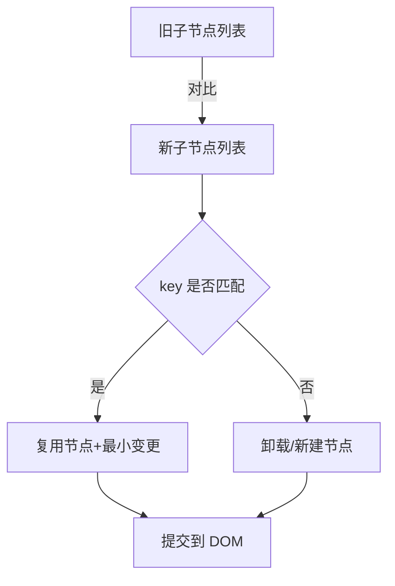

# 第1章：从零认识 React（理念、组件化与渲染流程）

> 导读  
> 本章回答三个问题：React 解决什么问题？如何用组件化与 JSX 描述 UI？一次渲染到底发生了什么？我们通过最小示例与两幅图（渲染管线/调和流程）建立整体视图，为后续 Hooks、路由、数据与工程化打下统一的心智模型。

## 学习目标
- 理解 React 的核心理念：声明式、单向数据流、组件化
- 认识 JSX 的本质与类型检查，能写出最小可运行组件
- 掌握“描述 UI → 渲染 → 调和（diff）→ 提交”的基本流程
- 初步理解事件系统与受控/非受控表单的取舍

---

## 1.1 为什么是 React：声明式与单向数据流
- 声明式：通过“状态 → 视图”的映射描述 UI，减少命令式 DOM 操作
- 单向数据流：父 → 子的自上而下数据流，有助于定位问题与提升可维护性
- 组件化：将 UI 拆为可复用的最小单元，组合构建复杂界面

对比命令式思维：在 React 中你只需更新状态，React 负责计算差异并“最小化更新 DOM”。

---

## 1.2 JSX：语法糖与类型系统
- JSX 是 `React.createElement(type, props, ...children)` 的语法糖；在 TS 环境下有完善的类型提示
- 只要记住：JSX 里用 `{}` 插入表达式，属性名使用小驼峰（如 `className`）

最小示例：
```tsx
type HelloProps = { name: string }
export function Hello({ name }: HelloProps) {
  return <h1 className="text-xl">你好，{name}</h1>
}
```

在父组件中使用：
```tsx
export default function App() {
  return (
    <div className="p-6">
      <Hello name="React" />
    </div>
  )
}
```

---

## 1.3 渲染到真实世界：渲染与提交（commit）
一次完整更新通常包含两个阶段：
- 渲染阶段（Render）：根据最新的 props/state 计算出新的虚拟树（不触发 DOM）
- 提交阶段（Commit）：将变更最小化地应用到真实 DOM，触发布局/绘制

渲染管线（示意）：


关键结论：
- 渲染阶段可被打断（并发特性），提交阶段原子完成
- 你只关心“描述 UI”，React 负责“如何高效变更”

---

## 1.4 调和（Reconciliation）与 key
- React 通过 key 辅助识别同层节点是否“可复用”
- 列表渲染必须提供稳定 key；使用索引作为 key 可能导致状态错位

调和规则（简化示意）：


示例：列表渲染
```tsx
const users = [{id: 'u1', name: 'A'}, {id: 'u2', name: 'B'}]
export function UserList() {
  return (
    <ul>
      {users.map(u => <li key={u.id}>{u.name}</li>)}
    </ul>
  )
}
```

---

## 1.5 事件系统与合成事件
- React 使用合成事件（SyntheticEvent）提供跨浏览器一致行为
- 事件回调在渲染后的提交阶段绑定；在并发模式下仍保证语义一致

示例：
```tsx
export function Clicker() {
  function handleClick(e: React.MouseEvent<HTMLButtonElement>) {
    console.log('坐标', e.clientX, e.clientY)
  }
  return <button onClick={handleClick}>点我</button>
}
```

---

## 1.6 表单：受控与非受控的入门视角
- 受控组件：表单值由 React state 驱动（双向绑定清晰、便于校验）
- 非受控组件：通过 ref 直接读取 DOM 值（适合简单、低频读的场景）

对比示例：
```tsx
import { useRef, useState } from "react";

// 受控
export function ControlledInput() {
  const [value, setValue] = useState("")
  return <input value={value} onChange={(e) => setValue(e.target.value)} />
}

// 非受控
export function UncontrolledInput() {
  const ref = useRef<HTMLInputElement>(null)
  return (
    <>
      <input ref={ref} />
      <button onClick={() => console.log(ref.current?.value)}>读取</button>
    </>
  )
}
```

实践建议：
- 表单较复杂/需联动校验 → 受控搭配库（第6章会用 React Hook Form）
- 简单输入/极少校验 → 非受控更轻

---

## 1.7 常见误解与避坑
- “虚拟 DOM 一定更快”并非总成立：多数情况下胜在工程复杂度与一致性，而非纯性能
- “索引当 key 没问题”在插入/删除/排序时会引发状态错位，应使用业务稳定 ID
- “所有逻辑都放 Effect”是反模式：计算逻辑应尽量在渲染中或 useMemo 中完成

---

## 示例对接（examples/react-ts-starter）
在示例项目中新建以下文件：
- src/demo/Hello.tsx
- src/demo/Clicker.tsx

引入使用（示例）：
```tsx
// src/App.tsx 中添加
import { Hello } from "./demo/Hello"
import { Clicker } from "./demo/Clicker"

export default function App() {
  return (
    <div className="p-6 space-y-4">
      <Hello name="React" highlight />
      <Clicker />
    </div>
  )
}
```

运行验证：
```bash
npm run dev
# 或
npm run preview
```

---

## 本章小结
- React 用声明式与单向数据流组织 UI，组件化是复用与复杂度管理的关键
- JSX 是语法糖，本质是“描述 UI 结构”的 JS/TS 表达式
- 更新流程分为渲染与提交，调和依赖 key 来最小化变更
- 入门阶段理解受控/非受控的权衡，为后续表单章节做铺垫

---

## 练习题
1) 编写一个 Hello 组件接收 `name` 与 `highlight`（布尔）两个 props，`highlight=true` 时以加粗+主色显示  
2) 为一个可编辑用户列表渲染 `li`，用稳定 `id` 作为 key，并尝试插入中间项验证 key 的效果  
3) 将第0章示例项目中 App.tsx 引入本章的 Hello/Clicker 组件，验证事件与渲染行为  
4) 将一个简单输入框实现受控与非受控两个版本，对比实现复杂度

---

## 延伸阅读
- React 官方文档：Describing UI / Adding Interactivity / Reconciliation
- React Conf：关于并发渲染的介绍（理解 Render 可被打断、Commit 原子）
- 文章：列表渲染与 key 的正确使用场景解析