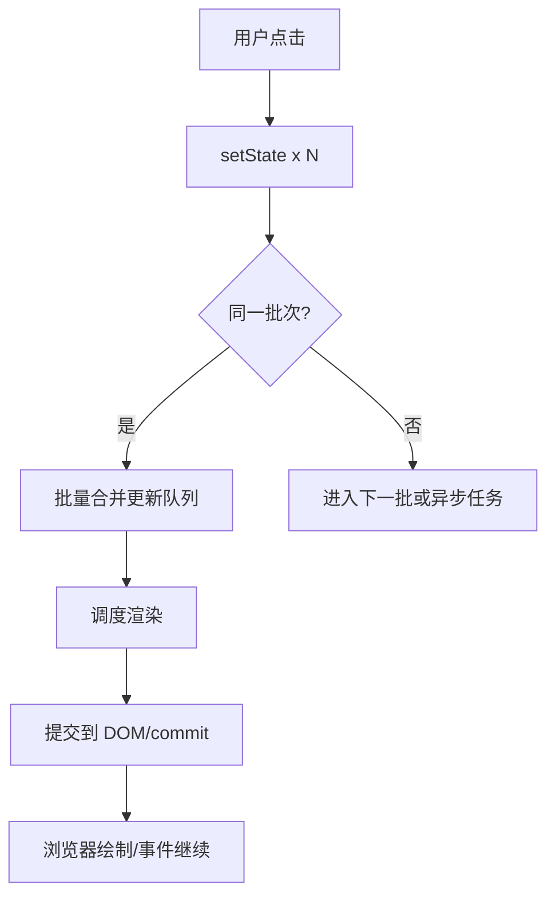
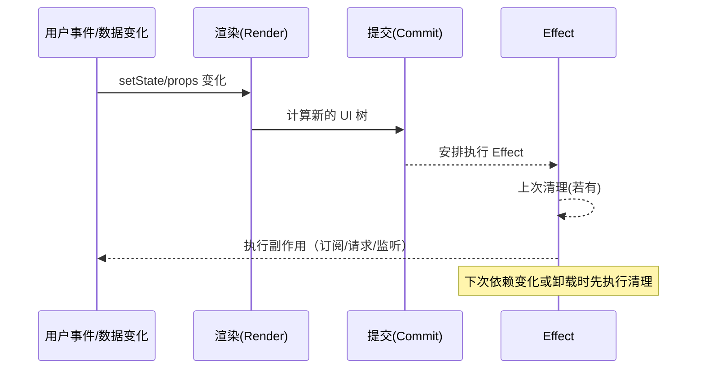
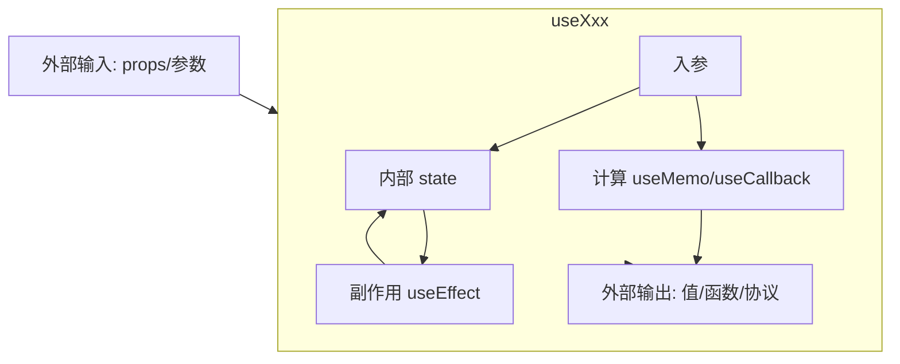

# 第2章：函数组件与 Hooks 核心

> 导读  
> React 19 中，函数组件与 Hooks 是默认范式。掌握 useState/useEffect/useRef/useMemo/useCallback 是写好组件的基石；理解渲染与闭包关系、依赖数组语义、过度重渲染的成因与优化策略，才能把项目做“稳”“快”。本章以心智模型 → 常用 Hooks → 并发与过渡 → 自定义 Hooks → 性能与排错，为你建立系统、可靠的使用方法。示例基于 React 19 + TypeScript + Vite（仓库：examples/react-ts-starter）。

## 学习目标

- 建立“渲染是纯函数 + 状态机”的心智模型，理解闭包快照和每次渲染的独立性
- 正确使用 useState/useEffect/useRef/useMemo/useCallback，避免依赖与闭包陷阱
- 了解并发特性中的过渡更新（startTransition）的价值与边界
- 能抽象可复用的自定义 Hooks，并用 ESLint 规则保障正确性
- 掌握常见性能与行为问题的定位与优化思路

---

## 2.1 渲染心智模型：纯函数 + 状态机

- 纯函数：UI = f(props, state)。同一输入应产出同一 UI 结构（无副作用）。
- 状态机：setState 触发新的渲染（一次新的“计算快照”）。
- 闭包快照：每次渲染中的变量、函数、状态值都“冻结”在那次渲染的环境里，之后不会被更改。

关键约束：
- Hooks 只能在组件顶层调用（不在条件/循环/嵌套函数中）
- 状态不可变更新（返回新引用），利于比较与优化
- 副作用由 useEffect/useLayoutEffect 管理，不放在渲染过程中做副作用

---

## 2.2 useState：状态与批量更新

最小示例（推荐函数式更新，规避读取旧值）：
```tsx
import { useState } from "react";

export function Counter() {
  const [count, setCount] = useState(0);

  function incTwice() {
    setCount((c) => c + 1);
    setCount((c) => c + 1); // 同一事件中批处理：最后 +2
  }

  return <button onClick={incTwice}>点击 +2：{count}</button>;
}
```

要点与技巧：
- 初始值惰性计算：`useState(() => heavyCalc())`
- 对象/数组：务必返回新引用（如 `setUser((u) => ({ ...u, name }))`）
- 批处理：React 19 默认在更多场景下批处理更新；跨异步边界行为以官方实现为准（建议以测量为准）

批处理流程（示意）：


---

## 2.3 useEffect：副作用、清理与依赖数组

副作用在提交到 DOM 后调度执行；清理函数在下一次 effect 前或卸载时运行。

典型请求与竞态清理：
```tsx
import { useEffect, useState } from "react";

type User = { name: string };
export function UserProfile({ id }: { id: string }) {
  const [data, setData] = useState<User | null>(null);
  const [loading, setLoading] = useState(false);

  useEffect(() => {
    let aborted = false;
    setLoading(true);
    fetch(`/api/users/${id}`)
      .then((r) => r.json())
      .then((d: User) => {
        if (!aborted) setData(d);
      })
      .finally(() => {
        if (!aborted) setLoading(false);
      });
    return () => {
      aborted = true; // 阻止过期响应覆盖新数据
    };
  }, [id]);

  if (loading) return <p>加载中…</p>;
  if (!data) return null;
  return <div>{data.name}</div>;
}
```

Effect 生命周期（时序）：


依赖数组指南：
- 把 effect 内使用到的“外部可变值”（props、state、非稳定引用的函数/对象）加入依赖
- 若只想“首渲染一次”，请确认依赖闭包稳定（或将逻辑迁移到更合适的位置，如事件或数据层）
- 配置 ESLint 插件 `react-hooks/exhaustive-deps` 强制校验

常见误区：
- 漏依赖导致读取陈旧值（stale closure）
- 在 effect 里做纯计算（应放渲染或 useMemo）

---

## 2.4 useRef：跨渲染持久化的容器 & DOM 引用

- `useRef` 提供一个 `.current` 容器，修改不会触发渲染，常用于保存实例/定时器/上次值。
- 用于 DOM：`<input ref={inputRef} />` 与 `inputRef.current?.focus()`。

保存上次 props 的示例：
```tsx
import { useEffect, useRef } from "react";

export function usePrevious<T>(value: T) {
  const prev = useRef<T>();
  useEffect(() => {
    prev.current = value;
  }, [value]);
  return prev.current;
}
```

---

## 2.5 useMemo/useCallback：缓存计算与稳定引用

- `useMemo`：缓存“返回值”
- `useCallback`：缓存“函数”，等价于 `useMemo(() => fn, deps)`

避免不必要的子组件重渲染：
```tsx
import { memo, useCallback, useState } from "react";

const Item = memo(function Item({ onClick }: { onClick: () => void }) {
  return <button onClick={onClick}>子按钮</button>;
});

export function List() {
  const [count, setCount] = useState(0);
  const stableClick = useCallback(() => {
    console.log("stable");
  }, []); // 依赖为 []，引用稳定

  return (
    <div>
      <button onClick={() => setCount((c) => c + 1)}>父计数：{count}</button>
      <Item onClick={stableClick} />
    </div>
  );
}
```

使用建议：
- 优化是为“性能瓶颈”服务的；优先用 Profiler/测量确认热点
- 频繁变动的数据/函数，缓存收益可能抵不过维护成本

---

## 2.6 并发与过渡：startTransition 降低交互卡顿

过渡更新把某些不紧急的更新标记为“可中断”，优先保证输入等紧急交互的流畅性。

搜索示例（输入即时更新；列表渲染作为过渡更新）：
```tsx
import { useState, startTransition } from "react";

export function SearchBox() {
  const [keyword, setKeyword] = useState("");
  const [list, setList] = useState<string[]>([]);

  function onChange(e: React.ChangeEvent<HTMLInputElement>) {
    const v = e.target.value;
    setKeyword(v); // 紧急更新：尽快响应输入
    startTransition(() => {
      // 非紧急：可以被打断
      const next = expensiveFilter(v); // 假设耗时
      setList(next);
    });
  }

  return (
    <div>
      <input value={keyword} onChange={onChange} />
      <ul>{list.map((i) => <li key={i}>{i}</li>)}</ul>
    </div>
  );
}

function expensiveFilter(q: string) {
  // 模拟重计算
  const arr = Array.from({ length: 8000 }, (_, i) => `item-${i}`);
  return arr.filter((x) => x.includes(q));
}
```

过渡更新（决策与流程）：
```mermaid
flowchart LR
  A[输入事件] --> B{更新类型}
  B -- 紧急UI(输入/光标) --> C[直接 setState]
  B -- 非紧急UI(列表/图表) --> D[startTransition(() => setState)]
  C --> E[高优先级渲染]
  D --> F[低优先级渲染(可中断)]
  E --> G[提交/绘制]
  F --> G
```

适用场景：
- 输入+复杂渲染（过滤、大列表渲染、图表刷新）
- 低优先级可中断的 UI 更新

---

## 2.7 自定义 Hooks：复用“状态+副作用+协议”

自定义 Hooks 是把“状态+副作用+业务协议”封装为可复用单元。命名以 `use` 开头，内部也须遵守 Hooks 规则。

示例：useDebouncedValue（输入防抖）
```tsx
import { useEffect, useState } from "react";

export function useDebouncedValue<T>(value: T, delay = 300) {
  const [debounced, setDebounced] = useState(value);
  useEffect(() => {
    const id = setTimeout(() => setDebounced(value), delay);
    return () => clearTimeout(id);
  }, [value, delay]);
  return debounced;
}
```

示例：useEvent（稳定回调的现代方案）
```tsx
import { useRef, useLayoutEffect } from "react";

/** 始终拿到最新的 fn，但对外暴露稳定引用 */
export function useEvent<T extends (...args: any[]) => any>(fn: T): T {
  const ref = useRef<T>(fn);
  useLayoutEffect(() => {
    ref.current = fn;
  });
  return useRef(((...args: any[]) => ref.current(...args)) as T).current;
}
```

自定义 Hook 结构（输入/输出/副作用）：


抽象建议：
- 明确职责单一（输入、输出、边界条件）
- 文档化依赖与副作用触发条件
- 配合 TS 泛型提升复用性

---

## 2.8 排错与度量：从“现象”回到“渲染与依赖”

定位思路：
- 观察“何时触发重渲染”：加日志或使用 React Profiler
- 检查 props 是否频繁变更（对象/函数是否稳定）
- 检查 effect 依赖与数据流向，是否产生竞态或陈旧闭包
- 用最小复现隔离问题，逐步恢复功能以缩小范围

常见症状与处置：
- 列表卡顿：虚拟化（react-window）、分片渲染、过渡更新
- 请求抖动：请求层做去抖/合并；或使用 React Query/SWR 缓存层
- 按钮点击无效：确认闭包是否指向旧回调；改用 `useEvent` 或提升依赖准确性

---

## 2.9 性能要点清单

- 数据层优先：避免“渲染层补锅”，用缓存、增量、索引优化数据
- 稳定引用：必要时 useMemo/useCallback + memo；避免“全量对象新建”
- 列表优化：key 稳定、虚拟化、大计算异步化或过渡
- 图片与样式：按需加载、代码分割、懒加载与骨架屏
- 度量先行：Profiler/性能面板/埋点监控，定位热点再优化

---

## 本章小结

- 函数组件每次渲染都是独立快照，副作用交给 useEffect 管理
- useRef 适合“跨渲染持久化”且“不触发渲染”的数据
- useMemo/useCallback 主要用于“稳定引用/缓存计算”，应按需使用
- 并发与 startTransition 通过“优先级”改善交互流畅度
- 自定义 Hooks 把“状态+副作用+协议”封装成复用单元

---

## 练习题

1) 用 useState 实现一个“步进器”，支持自定义步长（步长动态可改），点击后增加/减少；要求使用函数式更新，确保闭包安全。  
2) 将一个搜索输入框的过滤逻辑用 startTransition 改造，比较输入流畅度的差异。  
3) 实现 usePrevious Hook，并在组件中展示“当前值/上次值”；当 props 变化时验证其行为。  
4) 把一个频繁变化的对象 props 通过 useMemo 稳定下来，结合 memo 子组件观察重渲染次数变化。  
5) 实现 useDebouncedValue，并与输入框联动，观察防抖效果；思考取消与立即触发的边界条件。

提示与参考答案（可在后续提交中补充至 docs/answers/02.md）

---

## 延伸阅读

- React 官方文档：Describing UI / Adding Interactivity / Managing State / Escape Hatches  
- reactjs/rfcs：useEvent 等相关提案  
- Kent C. Dodds：Avoiding stale closures in React  
- React Conf 2021/2022：并发特性与过渡更新  
- React Query / SWR 官方文档：请求缓存策略与失效模型

---

## 附：简单演示入口（在示例仓库中粘贴）

在 examples/react-ts-starter/src/App.tsx 中临时测试：
```tsx
import { useState, useCallback } from "react";
import { Counter } from "./demo/Counter"; // 你可以新建 demo 目录
import { SearchBox } from "./demo/SearchBox";

export default function App() {
  const [show, setShow] = useState(true);
  const toggle = useCallback(() => setShow((s) => !s), []);
  return (
    <div style={{ padding: 16 }}>
      <button onClick={toggle}>切换示例</button>
      {show ? <Counter /> : <SearchBox />}
    </div>
  );
}
```

建议将本章代码片段拆分到 examples/react-ts-starter/src/demo 下，便于读者运行与对照阅读。