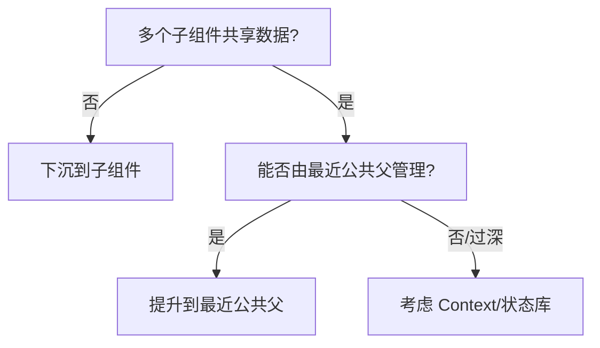

# 第3章：组件通信与状态提升、Context 与组合/插槽模式

> 导读  
> 本章围绕“数据如何在组件树中高效流动”展开：自上而下的 props、兄弟通信与状态提升、Context 应对“跨层级传递”、以及组合与插槽（children/render props）如何提升可复用性。最后给出选型建议与避坑清单。

## 学习目标
- 熟练掌握 props 通信与“状态提升”的设计方法
- 理解 Context 的适用边界与性能注意事项
- 能使用组合/插槽模式实现灵活 API
- 了解何时引入状态管理库，而非滥用 Context

---

## 3.1 自上而下：props 是默认选项
- props 单向流动最可控，调试与复用成本低
- 兄弟组件共享数据 → 优先“状态提升”到最近公共父组件

最小示例（状态提升）：
```tsx
import { useState } from "react";

function SearchInput({ value, onChange }: { value: string; onChange: (v: string) => void }) {
  return <input value={value} onChange={(e) => onChange(e.target.value)} placeholder="搜索..." />;
}

function ResultList({ keyword }: { keyword: string }) {
  const data = ["react", "vue", "svelte"];
  const list = data.filter((x) => x.includes(keyword.toLowerCase()));
  return <ul>{list.map((x) => <li key={x}>{x}</li>)}</ul>;
}

export function SearchPanel() {
  const [kw, setKw] = useState("");
  return (
    <div>
      <SearchInput value={kw} onChange={setKw} />
      <ResultList keyword={kw} />
    </div>
  );
}
```

---

## 3.2 何时状态提升，何时下沉？
- 提升：当多个子组件需要“读同一份真相”或对其做联动时
- 下沉：局部 UI 状态仅为某个子组件服务，不要提升（避免父组件无谓重渲染）

决策示意：


---

## 3.3 Context：解决“跨层级”但非全局状态库
- 适用于“主题/语言/当前用户/权限”等“读多写少”的跨层级数据
- 对频繁变化的值要谨慎：Provider value 变化会导致消费该上下文的子树重渲染

基础用法：
```tsx
import { createContext, useContext, useMemo, useState } from "react";

type Theme = "light" | "dark";
const ThemeCtx = createContext<{ theme: Theme; setTheme: (t: Theme) => void } | null>(null);

export function ThemeProvider({ children }: { children: React.ReactNode }) {
  const [theme, setTheme] = useState<Theme>("light");
  const value = useMemo(() => ({ theme, setTheme }), [theme]); // 保持稳定引用
  return <ThemeCtx.Provider value={value}>{children}</ThemeCtx.Provider>;
}

export function useTheme() {
  const ctx = useContext(ThemeCtx);
  if (!ctx) throw new Error("useTheme must be used within ThemeProvider");
  return ctx;
}
```

消费端：
```tsx
function Toolbar() {
  const { theme, setTheme } = useTheme();
  return (
    <div>
      <span>主题：{theme}</span>
      <button onClick={() => setTheme(theme === "light" ? "dark" : "light")}>切换</button>
    </div>
  );
}
```

性能提示：
- 使用 `useMemo` 包装 Provider 的 value，避免无关引用变化
- 拆分 Context：把“读多写少”的值与“高频变化”的值分开 Provider

---

## 3.4 组合与插槽：比继承更灵活
- children 作为默认插槽
- Render Props 用函数作为插槽，暴露“最小必要数据”，增强灵活性

children 插槽：
```tsx
function Card({ header, children, footer }: { header?: React.ReactNode; children?: React.ReactNode; footer?: React.ReactNode }) {
  return (
    <div className="border rounded p-3">
      {header && <div className="mb-2">{header}</div>}
      <div>{children}</div>
      {footer && <div className="mt-2 text-sm text-gray-500">{footer}</div>}
    </div>
  );
}
```

Render Props：
```tsx
type FetcherProps<T> = { url: string; children: (state: { data: T | null; loading: boolean; error: any }) => React.ReactNode };

function Fetcher<T>({ url, children }: FetcherProps<T>) {
  const [state, setState] = useState<{ data: T | null; loading: boolean; error: any }>({ data: null, loading: true, error: null });
  useEffect(() => {
    fetch(url)
      .then((r) => r.json())
      .then((d) => setState({ data: d, loading: false, error: null }))
      .catch((e) => setState({ data: null, loading: false, error: e }));
  }, [url]);
  return <>{children(state)}</>;
}
```

使用：
```tsx
<Fetcher<{ name: string }> url="/api/me">
  {({ data, loading }) => (loading ? <p>加载中…</p> : <p>{data?.name}</p>)}
</Fetcher>
```

对比 HOC：
- HOC 容易产生嵌套与类型穿透问题；现代代码更多使用组合、Render Props、自定义 Hooks

---

## 3.5 选型建议：Context vs 状态库
- Context 更像“传输通道”，不提供“推导/派发/中间件/持久化”等配套能力  
- 需要跨页面复杂状态、异步流/缓存、调试工具 → 优先考虑 Redux Toolkit/ Zustand / Jotai / React Query 等

简表：
- 读多写少、跨层级：Context
- 缓存/异步请求/失效策略：React Query / SWR
- 大型共享状态、可观测：Redux Toolkit
- 轻量原子状态：Zustand / Jotai

---

## 3.6 避坑清单
- 在 Provider 的 value 上新建对象/函数导致整棵子树重渲染 → 用 useMemo/useCallback
- 滥用 Context 存放高频变化值（如输入值）→ 提升到近处并局部管理
- 把“展示/布局”与“状态/数据”混杂 → 分层并通过插槽组合
- 滥用 HOC 叠罗汉 → 优先组合与自定义 Hooks

---

## 本章小结
- 优先 props 与状态提升，Context 用于“跨层级且读多写少”的场景
- 组合/插槽是 React 复用核心；Render Props 适合逻辑→视图的灵活承接
- 复杂共享状态与异步缓存应交给专业状态/数据层库

---

## 练习题
1) 将“搜索面板”拆分为输入与结果两部分，完成状态提升并支持清空按钮  
2) 用 Context 提供“当前登录用户”，在多处消费，尝试在 Provider 侧用 useMemo 稳定 value  
3) 用 children/slots 重构一个 Card 组件（含 header/footer 插槽），并实现一个 Render Props 的计数器  
4) 思考：将高频变化的输入值放入 Context 有何问题？如何设计拆分方案？

---

## 延伸阅读
- React Docs：Context、Composition vs Inheritance
- Redux Toolkit、Zustand、Jotai 官方文档
- React Query/SWR：缓存与失效模型