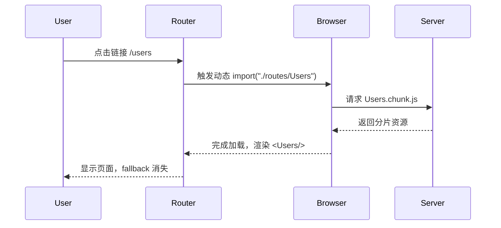

# 第4章 路由与代码分割（React Router 6+，Suspense 与懒加载）

## 导读
React 应用的核心体验之一是“无刷新导航”。本章从路由基础出发，系统讲解 React Router 6+ 的使用方式与最佳实践，并结合 React.lazy + Suspense 的路由级代码分割方案，覆盖布局路由、嵌套路由、动态路由、错误边界与加载态处理、预取策略等工程细节。目标是做到“切页快、首屏稳、错误可恢复、体验流畅”。

## 学习目标
- 掌握 React Router 6+ 的基本用法：Routes/Route、Link/NavLink、useNavigate、useParams、Outlet 等
- 构建布局路由与嵌套路由，管理公共导航与子页面结构
- 使用 React.lazy + Suspense 完成路由级代码分割和加载占位
- 处理 404/错误边界、空状态、加载骨架，完善体验细节
- 了解预加载策略（交互式预取）与路由性能优化思路

---

## 4.1 路由基础与核心概念

- 路由容器：BrowserRouter（History API）/ HashRouter（兼容性）
- 路由声明：Routes + Route（v6 移除了 Switch，改为 Routes 且匹配更严格）
- 页面跳转：Link/NavLink（高亮态）、useNavigate（编程式跳转）
- 参数读取：useParams、查询串读取：useSearchParams
- 占位渲染：Outlet（用于父级路由在布局中渲染子路由）

示例（基础路由）：
```tsx
// src/main.tsx
import React from "react";
import ReactDOM from "react-dom/client";
import { BrowserRouter } from "react-router-dom";
import App from "./App";

ReactDOM.createRoot(document.getElementById("root")!).render(
  <BrowserRouter>
    <App />
  </BrowserRouter>
);

// src/App.tsx
import React from "react";
import { Link, Routes, Route } from "react-router-dom";

function Home() { return <h3>Home</h3>; }
function About() { return <h3>About</h3>; }

export default function App() {
  return (
    <div>
      <nav style={{ display: "flex", gap: 12 }}>
        <Link to="/">Home</Link>
        <Link to="/about">About</Link>
      </nav>

      <Routes>
        <Route path="/" element={<Home/>} />
        <Route path="/about" element={<About/>} />
        <Route path="*" element={<div>404 Not Found</div>} />
      </Routes>
    </div>
  );
}
```

要点：
- v6 开始采用“最短路径优先”与严格匹配；`*` 用于兜底 404。
- 使用 NavLink 可自动管理选中态；useNavigate 实现“回退/前进/跳转”。

---

## 4.2 布局路由与嵌套路由

在中后台或多区域应用中，通常存在“顶部导航/侧栏 + 主内容”的固定布局。布局组件在父级路由中渲染，子页面通过 Outlet 占位。

```tsx
// src/routes/Layout.tsx
import React from "react";
import { Link, Outlet } from "react-router-dom";

export default function Layout() {
  return (
    <div className="min-h-screen flex">
      <aside className="w-60 border-r p-3 space-y-2">
        <div className="font-semibold mb-2">Demo</div>
        <div className="flex flex-col gap-2">
          <Link to="/users">Users</Link>
          <Link to="/settings/profile">Profile</Link>
        </div>
      </aside>
      <main className="flex-1 p-6">
        <Outlet />
      </main>
    </div>
  );
}

// src/App.tsx（片段）
import Layout from "./routes/Layout";
import Users from "./routes/Users";
import Profile from "./routes/settings/Profile";

<Routes>
  <Route element={<Layout />}>
    <Route path="/users" element={<Users />} />
    <Route path="/settings">
      <Route path="profile" element={<Profile />} />
    </Route>
  </Route>
  <Route path="*" element={<div>404</div>} />
</Routes>
```

注意：
- 父级 Route 不必指定 path 时，可作为“包裹路由”承载布局。
- 子路由路径写相对路径更清晰（如 settings 内写 profile）。

---

## 4.3 路由级代码分割：React.lazy + Suspense

路由维度按需加载可显著降低首屏包体。推荐使用 React.lazy + Suspense 包裹路由元素。

```tsx
// src/App.tsx（路由懒加载）
import React, { Suspense, lazy } from "react";
import { Routes, Route } from "react-router-dom";
import Layout from "./routes/Layout";

const Users = lazy(() => import("./routes/Users"));
const Profile = lazy(() => import("./routes/settings/Profile"));

function PageLoading() {
  return <div className="p-4">页面加载中...</div>;
}

export default function App() {
  return (
    <Suspense fallback={<PageLoading />}>
      <Routes>
        <Route element={<Layout />}>
          <Route path="/users" element={<Users />} />
          <Route path="/settings/profile" element={<Profile />} />
        </Route>
        <Route path="*" element={<div>404</div>} />
      </Routes>
    </Suspense>
  );
}
```

- fallback 作为占位骨架，避免“白屏”。工程中可使用 Skeleton/Spinner 或骨架屏。
- 对首屏路由不建议懒加载（防止额外的延迟抖动）。

Mermaid：导航与懒加载流程


---

## 4.4 动态路由、参数与搜索串

- 动态片段：`/users/:id`，用 `useParams()` 读取
- 查询串：`useSearchParams()` 读写

```tsx
import React from "react";
import { useParams, useSearchParams } from "react-router-dom";

export default function UserDetail() {
  const { id } = useParams();
  const [qs, setQs] = useSearchParams();
  const tab = qs.get("tab") ?? "profile";

  return (
    <div>
      <h3>User #{id}</h3>
      <p>当前 Tab: {tab}</p>
      <button onClick={() => setQs({ tab: "settings" })}>切换到设置</button>
    </div>
  );
}
```

建议：
- 参数变化会导致页面重渲染，必要时对昂贵子树进行 memo 化。
- URL 即状态：将可分享/可回放的 UI 状态放入查询串（而非组件局部 state）。

---

## 4.5 错误边界与空/加载态

- 数据请求类页面：需要“加载中/空/错误”三态
- 懒加载异常：使用错误边界兜底（如 react-error-boundary），或 React Router v6.4+ 的 `errorElement`

```tsx
// 简易错误边界
import React from "react";
class ErrorBoundary extends React.Component<any, { hasError: boolean }> {
  constructor(props:any){ super(props); this.state = { hasError: false }; }
  static getDerivedStateFromError(){ return { hasError: true }; }
  render(){ return this.state.hasError ? <div>页面出错了</div> : this.props.children; }
}

// 包裹 Suspense + Routes
<ErrorBoundary>
  <Suspense fallback={<PageLoading/>}>
    <Routes>{/* ... */}</Routes>
  </Suspense>
</ErrorBoundary>
```

最佳实践：
- Loading：骨架屏（Skeleton）优先于纯文字“加载中…”
- Empty：明确引导“去创建/去配置”，不仅仅是“暂无数据”
- Error：展示错误摘要 + 重试按钮，必要时上报异常

---

## 4.6 预加载与体验优化

- 交互式预取：在链接 hover/即将进入视口时执行 `import()` 预取分片
- 静态预取：使用 `<link rel="prefetch">` 或构建工具插件
- 首屏稳定：首屏路由不懒，次级路由懒；避免“大而全”的单包

交互式预取示例：
```tsx
import React, { useRef } from "react";
import { Link } from "react-router-dom";

export function PrefetchLink() {
  const timer = useRef<number | null>(null);
  const prefetch = () => import("../routes/Users"); // 仅触发加载

  return (
    <Link
      to="/users"
      onMouseEnter={() => {
        if (timer.current) return;
        timer.current = window.setTimeout(prefetch, 50);
      }}
      onMouseLeave={() => {
        if (timer.current) { window.clearTimeout(timer.current); timer.current = null; }
      }}
    >
      Users
    </Link>
  );
}
```

---

## 4.7 与数据获取的协同

- 本章聚焦路由/分包，不展开数据层；建议结合 SWR/React Query 统一缓存与错误/重试
- 分包页面中，将“数据状态”与“UI骨架”搭配，保证切页加载平滑

---

## 本章小结
- React Router 6+ 提供更直观的声明式路由与严格匹配；配合 Outlet 构建布局-子页架构
- 使用 React.lazy + Suspense 做路由级代码分割，配合骨架/错误边界完善体验
- 通过交互式预取降低首次进入子页面的等待时间
- URL 即状态：善用动态路径与查询串承载可分享/可回放的 UI 状态

---

## 练习（建议 20–40 分钟）
1) 将当前项目的“用户”模块改为懒加载，并为其添加骨架屏与错误边界
2) 实现一个“设置”父路由与若干子路由（profile/security/notifications），要求：
   - 父级提供左侧菜单，子路由通过 Outlet 渲染
   - 使用 NavLink 高亮当前菜单
3) 实现一个 PrefetchLink，对 hover 的路由页面进行 `import()` 预取；并通过网络面板观察分片请求
4) 将“搜索条件”与“当前选中 Tab”存入查询串，实现刷新/分享后状态一致

提示/参考：
- 对首屏路由不要懒加载；子页面懒加载 + 骨架更优
- 错误边界用 react-error-boundary 或自定义类组件均可

---

## 延伸阅读
- React Router 文档（v6+）：https://reactrouter.com/
- Code-Splitting（React 官方）：https://reactjs.org/docs/code-splitting.html
- Route-level code splitting patterns：动态 import 与预取策略
- Suspense for Data Fetching（前瞻，生态逐步推进）

## 版本与补遗
- React Router v6.4+ Data APIs：在路由层提供 loader/action/defer 与 errorElement，使“切页即数据”成为一等公民。适合“页面级数据”与“提交流程”统一管理。
- 组件内获取 vs 路由数据：组件内（SWR/RQ）更灵活、利于复用；路由数据更早、更一致、与错误边界深度集成。可采用“首屏/切页走路由数据，页面内细粒度走 SWR/RQ”的组合。
- defer 与骨架：defer 可并行/懒加载部分数据，配合 Suspense 控制子树占位，避免整页白屏。
- 迁移建议：新增页面优先考虑 Data API；存量页面保留 SWR/RQ，逐步将切页关键数据迁到 loader。